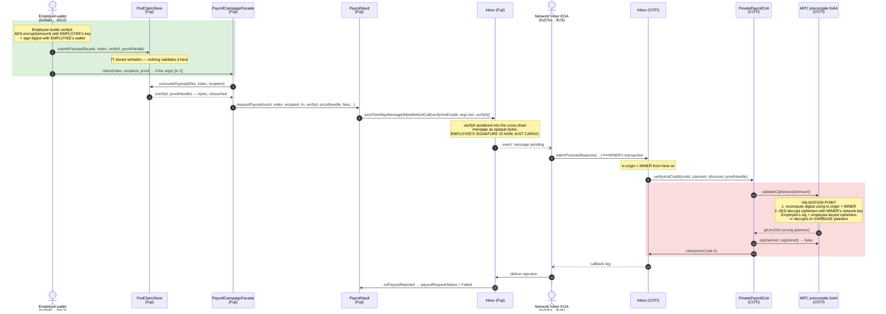
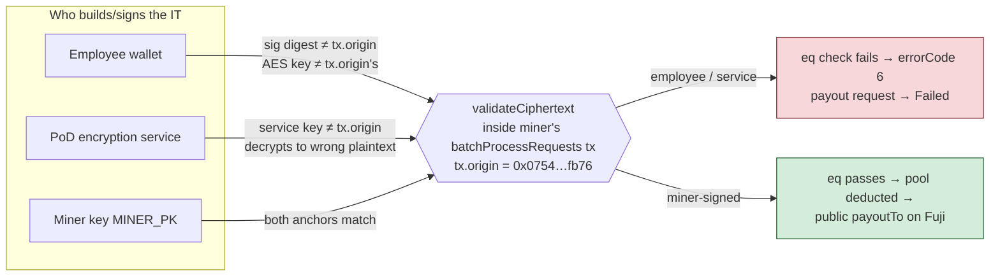

# Claim flow — how the employee's signature travels to the validation point (and why it fails there)

*Context: pod-dapp-ports **iteration 10** deploy (2026-07-22 08:42 UTC manifest). Live network miner: `0x075445b969e2a39e096dd1fbe9a323ae3353fb76` (same EOA mines the inbox on both Fuji and COTI).*

## What a verify IT actually is

The "IT" (input text) the employee submits is **two identity-bound pieces**:

```
itUint256 = {
  ciphertext:  AES-CTR(amount)  encrypted under ⟨account⟩'s COTI network AES key
  signature:   EOA sig over digest(ciphertext, validatingContract, functionSelector, ⟨account⟩)
}
```

Both pieces are anchored to **one account** — and COTI's MPC resolves that account as
**`tx.origin` of the transaction that executes `validateCiphertext`**, not as whoever
built or submitted the IT earlier in the pipeline.

## The journey of the employee's signature



**The structural problem in one sentence:** the employee signs and encrypts in step 1,
but validation happens inside a transaction the **miner** sends (step 9–11), and the MPC
re-derives *both* the signature digest *and* the AES decryption key from `tx.origin` —
so only an IT built with the **miner's** wallet key + the **miner's** network AES key
survives the validation point.

## Where each candidate signer fails



Note the **register path never has this problem**: the employer calls
`registerLeaf(runId, index, …, itAmount)` as a **direct COTI transaction**, so
`tx.origin` = employer = IT signer, and the registered ciphertext validates and
onboards correctly. Only the *relayed* claim leg breaks the `tx.origin` assumption.

## Security & privacy notes

- **The miner key is not an authorization key.** A forged IT with a wrong amount still
  fails the `eq(claimed, registered)` check against the employer-registered ciphertext,
  and recipient binding (`registeredRecipient[index] == msg.sender` on Fuji,
  `_registeredEmployee == claimant` on COTI) + merkle proof + spent-bitmap carry all
  actual authorization. The IT is confidential *transport* for the amount only.
- **Privacy leak in the workaround:** a miner-signed IT is AES-encrypted under the
  miner's network key — the miner operator can read every claimed salary.

## Current handling (as wired in this repo)

**Decision (2026-07-22): the PoD SDK encryption service (`buildVerifyIt` / `CotiPodCrypto`)
is the ONLY verify-IT builder** — for the browser UI *and* the testnet suite. Employee
wallet-signing and the miner-key (`MINER_PK`) path were both explicitly rejected and the
wallet-signing builder was removed from the codebase so it cannot regress.

| Path | Verify IT builder | Works? |
|------|-------------------|--------|
| Browser UI (`useClaimFlow`) | PoD SDK service `buildVerifyIt` | ❌ Fuji txs succeed; COTI verification fails (errorCode 6) until the contract fix ships |
| Testnet suite (`claimOnChain`) | PoD SDK service `buildVerifyIt` | ❌ same errorCode-6 gap — the failing assert documents the contract gap, not a signer bug |

The gap is closed by the contract change below (option 2), not by changing signers.

## Paths that were considered to remove the miner dependency

1. **Verify-IT signing service** (near-term): a backend run by the miner operator returns
   miner-signed ITs on request `(amount, index)`. Forgery-safe (commitment check still
   gates amounts) but centralizes trust and inherits the salary-visibility leak above.
2. **Contract fix (recommended)**: drop the claim-time IT entirely — `verifyAndCredit`
   already holds the employer-registered ciphertext and only ever checks the claimant IT
   for *equality* against it. Paying out the **registered** amount removes the only
   miner-origin-validated input from the relay path, deletes `PodClaimStore` (claim
   becomes one Fuji tx), and removes the miner's salary visibility. See the proposed
   diffs to `PrivatePayrollCoti.verifyAndCredit` (3-arg), `PayrollVault.requestPayout`
   (IT-less), and `PayrollCampaignFacade._submitPayout` (inline proof handle).
3. **Protocol fix upstream**: PoD/COTI validates relayed ITs against the original
   requester (e.g. `inboxMsgSender`) instead of `tx.origin` — restores end-to-end
   confidentiality for user-supplied ciphertexts on relayed calls generally.
