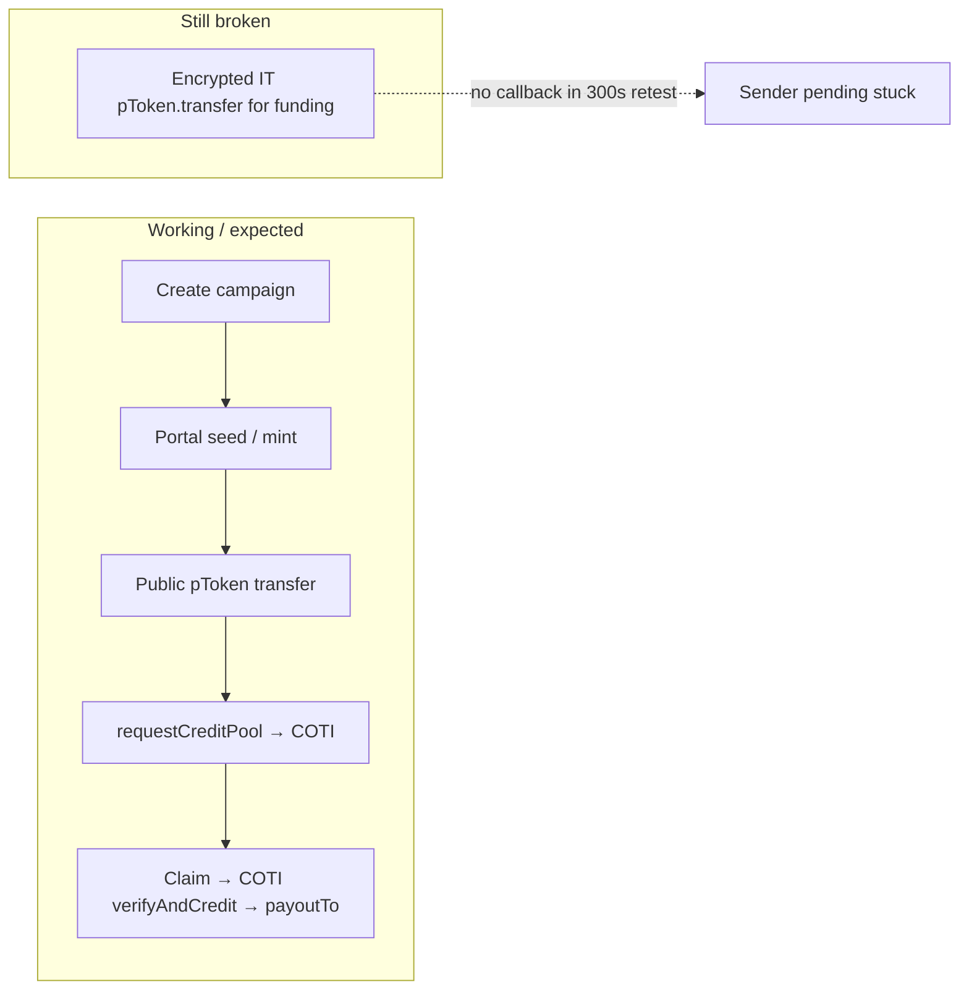

# Payroll UI — live testnet flow status

Status as of **2026-07-20**, against Avalanche Fuji + COTI testnet after the
[pod-dapp-ports](https://github.com/coti-io/pod-dapp-ports) **iter08-thin-fuji-facade**
redeploy (`requestCreditPool` / no Fuji `MpcCore` / live `PayrollVault.estimateFee()` —
no fees are baked into the contracts anymore).

| Flow | Doc | Verdict |
|------|-----|---------|
| Create campaign | [createCampaign.md](./createCampaign.md) | **Working** end-to-end (with COTI fee-bump retries in tests) |
| Fund campaign | [fundCampaign.md](./fundCampaign.md) | **Working** on live — public transfer → `requestCreditPool` → `PoolCredited` |
| Claim payroll | [claimCampaign.md](./claimCampaign.md) | **Working** (fixed 2026-07-20) — verify-IT must be built via the PoD encryption service (`@coti-io/pod-sdk`), not a locally wallet-signed IT; see the doc for the full root-cause trail |

### Legend used in the flow docs

| Marker | Meaning |
|--------|---------|
| OK | Observed green on live Fuji + COTI testnet |
| FLAKY | Works most of the time; needs retries (mempool drops / fee bumps) |
| BROKEN | Consistently fails or leaves irreversible stuck state |
| N/A | Not part of that flow / removed by redesign |

### Code entrypoints

| Surface | Create | Fund |
|---------|--------|------|
| UI hook | `src/hooks/useCreateCampaign.ts` | `src/hooks/useFundCampaign.ts` |
| Testnet suite | `tests/testnet/createCampaign.test.ts` | `tests/testnet/fundCampaign.test.ts` |
| Shared helpers | `tests/testnet/helpers.ts` (`createCampaignOnChain`, COTI retries, settle wait) | same |
| Fees | `src/lib/podFees.ts` (`estimateVaultTwoWayFees`) | `src/lib/podFees.ts` (`computePTokenTwoWayFees`, `estimateVaultTwoWayFees`) — no stored constants; quoted live against `PayrollVault.estimateFee()` / the inbox |
| Addresses | `src/config/contracts.ts` | same |
