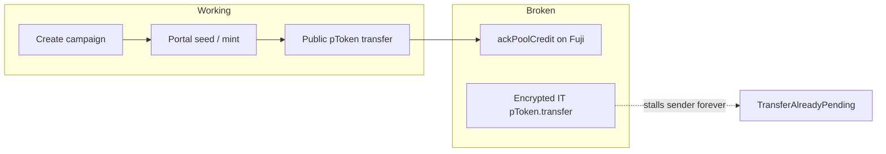

# Payroll UI — live testnet flow status

Status as of **2026-07-19**, verified against Avalanche Fuji + COTI testnet via
`npm run test:testnet`.

| Flow | Doc | Verdict |
|------|-----|---------|
| Create campaign | [createCampaign.md](./createCampaign.md) | **Working** end-to-end (with COTI fee-bump retries in tests) |
| Fund campaign | [fundCampaign.md](./fundCampaign.md) | **Partial** — tokens reach the facade; `ackPoolCredit` still breaks |

### Legend used in the flow docs

| Marker | Meaning |
|--------|---------|
| OK | Observed green on live Fuji + COTI testnet |
| FLAKY | Works most of the time; needs retries (mempool drops / fee bumps) |
| BROKEN | Consistently fails or leaves irreversible stuck state |
| N/A | Not part of that flow |

### Code entrypoints

| Surface | Create | Fund |
|---------|--------|------|
| UI hook | `src/hooks/useCreateCampaign.ts` | `src/hooks/useFundCampaign.ts` |
| Testnet suite | `tests/testnet/createCampaign.test.ts` | `tests/testnet/fundCampaign.test.ts` |
| Shared helpers | `tests/testnet/helpers.ts` (`createCampaignOnChain`, COTI retries, settle wait) | same |
| Fees | — | `src/lib/podFees.ts` (`computePTokenTwoWayFees`) |
