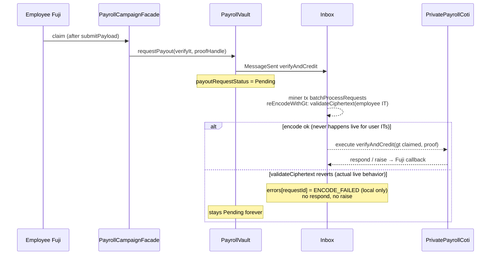

# Claim campaign flow

**Status: broken on live — root cause confirmed (2026-07-19).** Everything up to and
including the Fuji `claim` tx works; the COTI `verifyAndCredit` leg is **never invoked**.
The COTI inbox fails to re-encode the message because `MpcCore.validateCiphertext`
reverts on the employee's `itUint256`, records `ENCODE_FAILED` locally, and never calls
back to Fuji — so `payoutRequestStatus` stays **Pending** forever and `hasClaimed`
never flips. This is an architectural incompatibility (user-bound ITs cannot cross the
PoD inbox on real COTI), not a UI/test bug. Details in
[Root cause (confirmed)](#root-cause-confirmed).

Verified with `npm run test:testnet -- tests/testnet/claimCampaign.test.ts`
(`.env` `CLAIM_ADDRESS` / `CLAIM_PK`), the same pattern in UI claim attempts, and by
querying the COTI inbox `errors` mapping directly.

---

## Latest live result (automated test)

| Step | Result | Evidence |
|------|--------|----------|
| Create (Fuji factory + COTI `registerRun` / `registerLeaf`) | OK | runId `3`, facade `0x1035fc4856F6361f1433ab706f812886b9DbE747` |
| Fund (portal → public `pToken.transfer` → `requestCreditPool`) | OK | Fuji `poolCreditedTotal = 100 pMTT` |
| COTI `creditPool` for that fund | OK | COTI `PoolCredited(runId=3)` at block `8582783` |
| Facade AVAX top-up | OK | balance after claim still ≫ `inboxFeeWei` |
| `submitPayload(verifyIt, proof)` | OK | tx `0xb1c497d9…` |
| Fuji `claim` | OK | tx `0x01bccba1…0938` — Inbox `MessageSent` + vault `PayoutRequested` + `ClaimInstant` |
| COTI inbox re-encode of the message | **ENCODE_FAILED** | `errors(…098) = (code 2, 0xfe709212…3d796f)`, recorded in tx `0xe99867cd…7089` at block `8582789` |
| COTI `verifyAndCredit` | **Never invoked** | Encode fails before the target call; no `PayoutVerified`, and `_reject` is unreachable |
| Fuji callback | **Never sent** | Encode errors are recorded locally on the COTI inbox; no `respond`/`raise` → no `PayoutCompleted`/`PayoutFailed`; request `…098` stays `1` (Pending) |
| `hasClaimed(0)` | false | unchanged |

| Field | Value |
|-------|--------|
| runId | `3` |
| facade | `0x1035fc4856F6361f1433ab706f812886b9DbE747` |
| claimant | `0xAb81c57CCc578a5636BFF47B896BEC6Af1c30012` |
| claimTx | `0x01bccba104034fb12fbf83eecdeff3a7b49ec95a858c6496f330f808ace30938` |
| requestId | `0x000000000000a86900000000006c11a000000000000000000000000000000098` |
| failing COTI tx | `0xe99867cd3494aec726697799fb2d8db4af9d876a3b217cd8c5c7b79806327089` (miner `0x075445b969e2a39e096dd1fbe9a323ae3353fb76` → inbox `batchProcessRequests` `0x108e1536`) |
| vault | `0x5befe6a1a38881eb1e2be092c1dd730f45811801` |
| PrivatePayrollCoti | `0x0483a18becb2b1311b7fee7be7168bc2356f3b8a` |

Earlier UI attempts on runId `2` left the same stuck Pending requests (`…093`, `…094`).

---

## Root cause (confirmed)

### On-chain evidence

Querying the COTI inbox (`0xAb625bE229F603f6BBF964474AFf6d5487e364De`) directly:

- `errors(requestId)` for `…098`, `…093`, `…094` all return
  **`errorCode 2 = ERROR_CODE_ENCODE_FAILED`** with the identical opaque 32-byte
  payload `0xfe7092125aec8db3b33a152609bb6c7b66ae93b0a81479d9c31c2cd1003d796f`
  (not `Error(string)` / `Panic` — the gcEVM precompile's native revert blob).
- The full `ErrorReceived` history shows **every claim ever sent to this deploy failed
  the same way**: nonces `0x83, 0x85, 0x87, 0x8f, 0x93, 0x94, 0x98, 0x9c` — 8/8, all
  code 2, identical payload. Deterministic revert, not lag.
- `lastIncomingRequestId(43113)` is at nonce `0x9c`: inbox delivery itself is healthy.
  Plain-argument messages (`creditPool`) complete their two-way round trips fine.
- The failing COTI tx is sent by the **pod miner EOA** (`0x075445b9…`), never by the
  employee. That sender is the crux (below).

### Mechanism: why it hangs Pending instead of failing

In `InboxMiner._executeIncomingRequest`, the inbox first re-encodes the wire message
(`_safeEncodeMethodCall` → `MpcAbiCodec.reEncodeWithGt`), converting each `IT_UINT256`
arg to a `gtUint256` via `MpcCore.validateCiphertext`. That re-encode runs in a
try/catch; on revert the inbox **records the error locally** (`_recordEncodeError`),
marks the request executed, and returns — **no `respond`, no `raise`, no callback
leg**. `PrivatePayrollCoti.verifyAndCredit` is never even called, so its `_reject`
path (which would surface `PayoutFailed` on Fuji) is unreachable. The Fuji vault waits
for a callback that will never come.

Worse: `retryFailedRequest` only accepts `errorCode 1` (execution failure), so code-2
requests **cannot be retried** — and a retry would fail identically anyway.

### Why validateCiphertext reverts: user binding

The employee's verify IT (`buildVerifyIt` in `src/lib/buildPayrollIt.ts`) is signed by
the **employee** over the digest
`(signer=employee, contract=inbox, selector=batchProcessRequests, ctHigh, ctLow)`.
But COTI's gcEVM binds an input ciphertext to the **actual transaction context**: the
account that sent the COTI tx plus the validating contract and selector (the official
`coti-contracts` test suite confirms wrong-signer / wrong-contract ITs fail
validation). On COTI the claim message is executed inside a tx sent by the **miner**,
so the node reconstructs the digest with the miner's address; the employee's signature
can never match it, and the MPC precompile reverts. No signing scheme available to the
employee can fix this — they never send the COTI tx.

**Control case proving the IT format is fine:** `registerLeaf` ITs are built with the
same SDK helper and validate on live COTI — because there the employer **sends the
COTI tx themself**, so signer == tx sender.

### Why simCOTI passes and the fund path works

- **simCOTI:** `SimExtendedOperations.ValidateCiphertext` uses its own digest format,
  **recovers whichever signer** produced the signature, and decrypts with that
  signer's registered key — it never checks the tx sender. A miner-relayed employee IT
  therefore validates in sim. The sim is unfaithful to the real gcEVM on exactly this
  rule.
- **Fund path:** `requestCreditPool` → `creditPool(runId, uint256)` carries only plain
  `UINT256` args, which `MpcAbiCodec._normalizeArg` passes through untouched. No user
  IT ever crosses the inbox anywhere else in the system — the claim path is the only
  flow that ships one, and it fails 8-for-8.

### Not these (ruled out)

| Suspect | Why ruled out |
|---------|----------------|
| UI / test never submitting claim | Fuji receipt has 3 logs: Inbox + `PayoutRequested` + `ClaimInstant` |
| Facade out of AVAX for inbox fee | Balance after claim still ~0.049 AVAX; fee ~0.001 |
| Campaign not funded / no COTI pool | COTI `PoolCredited(runId=3)` landed; Fuji `poolCreditedTotal` matches |
| Run / leaf missing on COTI | `runs(3).exists == true`, leaf for index 0 registered, `isSpent(3,0) == false` |
| Soft reject inside `verifyAndCredit` (`_reject` → `inbox.raise`) | `verifyAndCredit` is never invoked — encode fails first |
| Total PoD inbox outage | Same inbox **does** complete `creditPool` two-way round-trips; delivery nonce advances past the stuck claims |
| Extreme callback lag | Failure is recorded on COTI within seconds of delivery, deterministically |

### What the contracts do



---

## Fix directions

1. **Follow the proven `registerLeaf` pattern:** have the employee submit their
   claimed-amount IT **directly to `PrivatePayrollCoti` in their own COTI tx**
   (validated + `offBoard`ed to a network-key ct), and have `verifyAndCredit`
   `onBoard` the stored ct instead of receiving an IT through the inbox.
2. **Or drop the encrypted eq-check:** the merkle leaf already binds
   `(index, claimant, amountCommitment)`, so the inbox leg could carry only public
   args.
3. **Inbox hardening (independent):** the inbox should `raise` back to the source
   chain on encode failure so vaults get `PayoutFailed` instead of hanging Pending;
   today encode errors silently strand requests. Also note `retryFailedRequest`
   excludes code-2 errors.
4. **Sim fidelity:** make `SimExtendedOperations.ValidateCiphertext` enforce the
   tx-sender binding so this class of failure reproduces in simCOTI.
5. The 32-byte error payload `0xfe709212…` could be confirmed against gcEVM executor
   logs by the COTI team, but is not needed for the diagnosis.

---

## What is *not* wrong in the UI/test

- iter08 shapes: `submitPayload` without payout IT; public `payoutTo(uint256)` after callback.
- Merkle package rebuilt from the create-time tree (same commitments registered on COTI).
- Claimant AES recovered via COTI AccountOnboard (`CLAIM_PK`); amount = registered plaintext
  (`100` pMTT in the test).
- Preflights: not expired, not claimed, facade funded with AVAX.

---

## Env / how to reproduce

```bash
# repo-root .env
PRIVATE_KEY3=…
PRIVATE_AES_KEY_TESTNET=…
CLAIM_ADDRESS=0xAb81c57CCc578a5636BFF47B896BEC6Af1c30012
CLAIM_PK=…
# optional after first onboard:
# PRIVATE_AES_KEY_CLAIM_TESTNET=…
# PRIVATE_AES_KEY_FUNDER_V4_TESTNET=…
```

```bash
cd ui
npm run test:testnet -- tests/testnet/claimCampaign.test.ts
```

Expect: create/fund green, then assertion failure on `result.completed` after 300s with
requestId still Pending. To confirm the root cause independently, read
`errors(requestId)` on the COTI inbox — it returns `(requestId, 2, 0xfe709212…)`.

Do **not** re-claim the same index while status is Pending — each attempt spawns
another permanently stuck request (8 so far on this deploy).

---

## Code entrypoints

| Surface | Path |
|---------|------|
| UI | `src/hooks/useClaimFlow.ts`, `src/components/claim/MyClaims.tsx` |
| Test | `tests/testnet/claimCampaign.test.ts` |
| Helpers | `tests/testnet/helpers.ts` (`claimOnChain`, `fundCampaignOnChain`) |
| IT builders | `src/lib/buildPayrollIt.ts` (`buildVerifyIt` — the IT that fails inbox validation) |
| Inbox encode/error path | `pod-dapp-ports/…/contracts/InboxMiner.sol` (`_executeIncomingRequest`), `InboxBase.sol` (`_safeEncodeMethodCall`, `_recordEncodeError`), `mpccodec/MpcAbiCodec.sol` (`IT_UINT256` branch) |
| Sim divergence | `sim-coti-node/contracts/SimExtendedOperations.sol` (`ValidateCiphertext`) |
