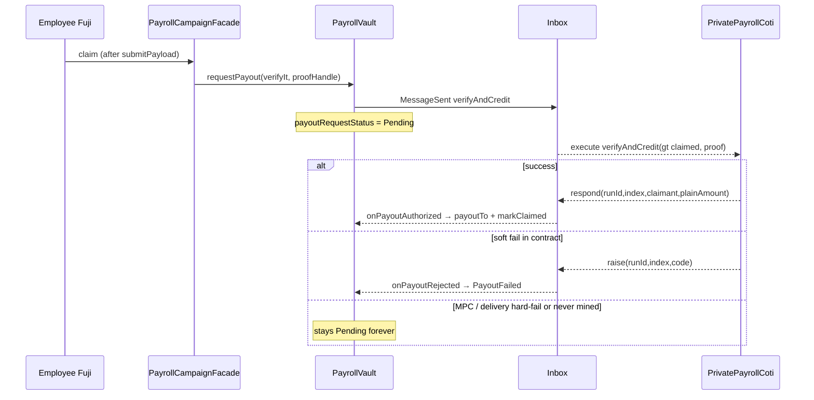

# Claim campaign flow

**Status: broken on live (2026-07-19)** — everything up to and including the Fuji
`claim` tx works; the COTI `verifyAndCredit` leg never finishes, so
`payoutRequestStatus` stays **Pending** and `hasClaimed` never flips.

Verified with `npm run test:testnet -- tests/testnet/claimCampaign.test.ts`
(`.env` `CLAIM_ADDRESS` / `CLAIM_PK`), and the same pattern showed up in the UI claim
attempts earlier the same day.

---

## Latest live result (automated test)

| Step | Result | Evidence |
|------|--------|----------|
| Create (Fuji factory + COTI `registerRun` / `registerLeaf`) | OK | runId `3`, facade `0x1035fc4856F6361f1433ab706f812886b9DbE747` |
| Fund (portal → public `pToken.transfer` → `requestCreditPool`) | OK | Fuji `poolCreditedTotal = 100 pMTT` |
| COTI `creditPool` for that fund | OK | COTI `PoolCredited(runId=3)` at block `8582783` |
| Facade AVAX top-up | OK | balance after claim still ≫ `inboxFeeWei` |
| `submitPayload(verifyIt, proof)` | OK | tx `0xb1c497d9…` |
| Fuji `claim` | OK | tx `0x01bccba1…0938` — Inbox `MessageSent` + vault `PayoutRequested` + `ClaimInstant` |
| COTI `verifyAndCredit` | **Never completes** | **No** `PayoutVerified` events on `PrivatePayrollCoti` for any recent run |
| Fuji callback | **Never arrives** | No `PayoutCompleted` / `PayoutFailed`; status of request `…098` still **`1` (Pending)** hours later |
| `hasClaimed(0)` | false | unchanged |

| Field | Value |
|-------|--------|
| runId | `3` |
| facade | `0x1035fc4856F6361f1433ab706f812886b9DbE747` |
| claimant | `0xAb81c57CCc578a5636BFF47B896BEC6Af1c30012` |
| claimTx | `0x01bccba104034fb12fbf83eecdeff3a7b49ec95a858c6496f330f808ace30938` |
| requestId | `0x000000000000a86900000000006c11a000000000000000000000000000000098` |
| vault | `0x5befe6a1a38881eb1e2be092c1dd730f45811801` |
| PrivatePayrollCoti | `0x0483a18becb2b1311b7fee7be7168bc2356f3b8a` |

Earlier UI attempts on runId `2` left the same stuck Pending requests (`…093`, `…094`).

---

## Why it is failing (root cause)

### Not these

| Suspect | Why ruled out |
|---------|----------------|
| UI / test never submitting claim | Fuji receipt has 3 logs: Inbox + `PayoutRequested` + `ClaimInstant` |
| Facade out of AVAX for inbox fee | Balance after claim still ~0.049 AVAX; fee ~0.001 |
| Campaign not funded / no COTI pool | COTI `PoolCredited(runId=3)` landed; Fuji `poolCreditedTotal` matches |
| Run / leaf missing on COTI | `runs(3).exists == true`, leaf for index 0 registered, `isSpent(3,0) == false` |
| Soft reject inside `verifyAndCredit` (`_reject` → `inbox.raise`) | That would surface as Fuji `PayoutFailed` with an error code — **never emitted** |
| Total PoD inbox outage | Same inbox **does** complete `creditPool` two-way round-trips for this deploy |

### What the contracts do



- **Fund path that works:** `creditPool(runId, uint256 amount)` — plain public amount,
  `MpcCore.setPublic256`, then `inbox.respond`. No user `itUint256`.
- **Claim path that sticks:** `verifyAndCredit(runId, claimant, gtUint256 claimed, proofHandle)`
  where `claimed` is produced by converting the employee’s **user-bound `itUint256`**
  (`buildVerifyIt` → inbox `batchProcessRequests` selector). Then COTI runs
  `onBoard` / `eq` / `decrypt` / encrypted pool deduct / `decrypt` plain amount /
  `inbox.respond`.

### Diagnosis

The Fuji→COTI message is **accepted** (`MessageSent` with destination
`PrivatePayrollCoti`), but on COTI:

1. There is **no** `PayoutVerified` (success path never ran), and  
2. Fuji never got `onPayoutRejected` (contract `_reject` path never completed either).

So the break is in the **claim MPC / inbox execution layer** for `verifyAndCredit`
(user IT → `gtUint256` + heavy MPC), not in the React UI and not in “forgot to fund.”
Most likely classes of failure:

1. **Inbox/MPC hard-reverts or drops** the claim request while converting/validating the
   employee IT (or mid-`verifyAndCredit` MPC ops), without calling `respond`/`raise` —
   Fuji then sits in Pending indefinitely.
2. Less likely once hours have passed: extreme callback lag (fund callbacks for the same
   runs completed in seconds).

This matches simCOTI passing (dual-chain mining + planted MPC) while live claim fails.

---

## What is *not* wrong in the UI/test

- iter08 shapes: `submitPayload` without payout IT; public `payoutTo(uint256)` after callback.
- Merkle package rebuilt from the create-time tree (same commitments registered on COTI).
- Claimant AES recovered via COTI AccountOnboard (`CLAIM_PK`); amount = registered plaintext
  (`100` pMTT in the test).
- Preflights: not expired, not claimed, facade funded with AVAX.

---

## Env / how to reproduce

```bash
# repo-root .env
PRIVATE_KEY3=…
PRIVATE_AES_KEY_TESTNET=…
CLAIM_ADDRESS=0xAb81c57CCc578a5636BFF47B896BEC6Af1c30012
CLAIM_PK=…
# optional after first onboard:
# PRIVATE_AES_KEY_CLAIM_TESTNET=…
# PRIVATE_AES_KEY_FUNDER_V4_TESTNET=…
```

```bash
cd ui
npm run test:testnet -- tests/testnet/claimCampaign.test.ts
```

Expect: create/fund green, then assertion failure on `result.completed` after 300s with
requestId still Pending.

---

## Code entrypoints

| Surface | Path |
|---------|------|
| UI | `src/hooks/useClaimFlow.ts`, `src/components/claim/MyClaims.tsx` |
| Test | `tests/testnet/claimCampaign.test.ts` |
| Helpers | `tests/testnet/helpers.ts` (`claimOnChain`, `fundCampaignOnChain`) |

---

## Next debug (inbox / contracts / ops)

1. Trace requestId `…098` (and `…093`/`…094`) in the PoD inbox / MPC executor logs on COTI —
   was `verifyAndCredit` ever invoked? revert reason?
2. Compare encoding of the employee IT in live `MessageSent` calldata vs sim harness
   `buildVerifyItAmount` (selector + user binding).
3. Confirm whether a failing `validateCiphertext` / MPC op reverts the whole inbox tx
   without `raise` (that would exactly produce everlasting Pending).
4. Do **not** re-claim the same index while status is Pending (spawns more stuck requests).
