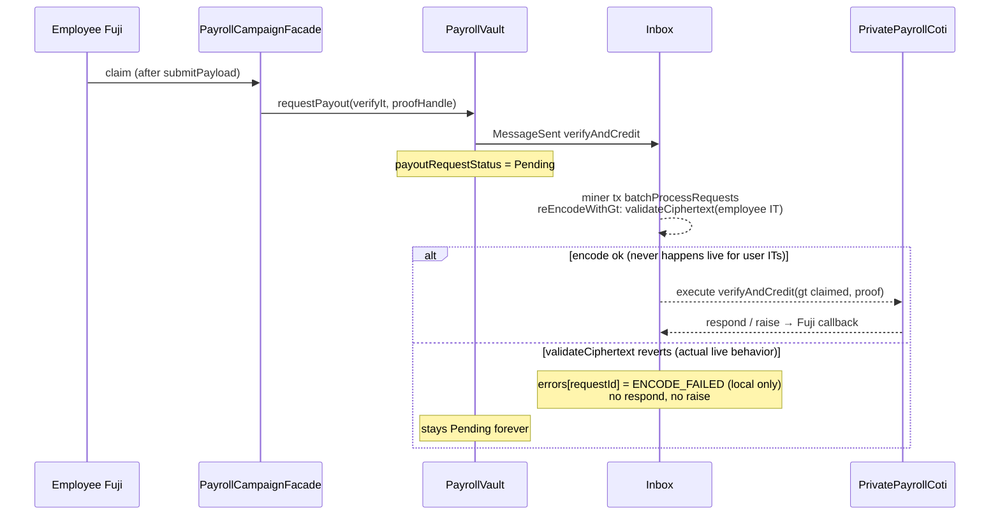
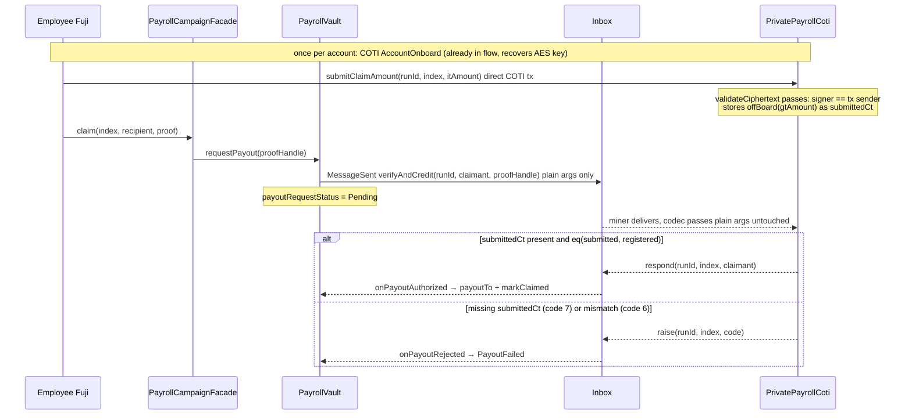

# Claim campaign flow

**Status: broken on live — ROOT CAUSE CONFIRMED: tx-context signature binding
(cause 2), 2026-07-19.** Everything up to and including the Fuji `claim` tx works; the
COTI `verifyAndCredit` leg is **never invoked**. The COTI inbox fails to re-encode the
message because `MpcCore.validateCiphertext` reverts on the employee's `itUint256`,
records `ENCODE_FAILED` locally, and never calls back to Fuji — so
`payoutRequestStatus` stays **Pending** forever and `hasClaimed` never flips.

The discriminating rerun settled the two candidate causes
(see [Which cause? Discriminating rerun](#which-cause-discriminating-rerun)):

1. **Wrong AES key ("local encryption") — real bug, but NOT the blocker.** Every
   earlier run did encrypt the claim IT under a non-network key (env-var mismatch +
   broken AES recovery; now fixed to pin `CLAIM_AES_KEY`). However, the rerun with
   the **correct** network key failed identically.
2. **Tx-context signature binding — CONFIRMED.** With the correct key, correct
   calldata, and a successfully mined Fuji claim, the relayed IT still failed
   `validateCiphertext` on COTI with the same `ENCODE_FAILED` + identical
   `0xfe709212…` payload (requestId `…0a0`) — now **9 out of 9** attempts. User-bound
   ITs cannot cross the PoD inbox in a miner-submitted tx.

The [iter09 proposal](#proposed-solution-iter09-submit-the-claim-amount-directly-on-coti)
is therefore **required** and proceeds.

Verified with `npm run test:testnet -- tests/testnet/claimCampaign.test.ts`
(`.env` `CLAIM_ADDRESS` / `CLAIM_PK`), the same pattern in UI claim attempts, and by
querying the COTI inbox `errors` mapping directly.

---

## Latest live result (automated test)

| Step | Result | Evidence |
|------|--------|----------|
| Create (Fuji factory + COTI `registerRun` / `registerLeaf`) | OK | runId `3`, facade `0x1035fc4856F6361f1433ab706f812886b9DbE747` |
| Fund (portal → public `pToken.transfer` → `requestCreditPool`) | OK | Fuji `poolCreditedTotal = 100 pMTT` |
| COTI `creditPool` for that fund | OK | COTI `PoolCredited(runId=3)` at block `8582783` |
| Facade AVAX top-up | OK | balance after claim still ≫ `inboxFeeWei` |
| `submitPayload(verifyIt, proof)` | OK | tx `0xb1c497d9…` |
| Fuji `claim` | OK | tx `0x01bccba1…0938` — Inbox `MessageSent` + vault `PayoutRequested` + `ClaimInstant` |
| COTI inbox re-encode of the message | **ENCODE_FAILED** | `errors(…098) = (code 2, 0xfe709212…3d796f)`, recorded in tx `0xe99867cd…7089` at block `8582789` |
| COTI `verifyAndCredit` | **Never invoked** | Encode fails before the target call; no `PayoutVerified`, and `_reject` is unreachable |
| Fuji callback | **Never sent** | Encode errors are recorded locally on the COTI inbox; no `respond`/`raise` → no `PayoutCompleted`/`PayoutFailed`; request `…098` stays `1` (Pending) |
| `hasClaimed(0)` | false | unchanged |

| Field | Value |
|-------|--------|
| runId | `3` |
| facade | `0x1035fc4856F6361f1433ab706f812886b9DbE747` |
| claimant | `0xAb81c57CCc578a5636BFF47B896BEC6Af1c30012` |
| claimTx | `0x01bccba104034fb12fbf83eecdeff3a7b49ec95a858c6496f330f808ace30938` |
| requestId | `0x000000000000a86900000000006c11a000000000000000000000000000000098` |
| failing COTI tx | `0xe99867cd3494aec726697799fb2d8db4af9d876a3b217cd8c5c7b79806327089` (miner `0x075445b969e2a39e096dd1fbe9a323ae3353fb76` → inbox `batchProcessRequests` `0x108e1536`) |
| vault | `0x5befe6a1a38881eb1e2be092c1dd730f45811801` |
| PrivatePayrollCoti | `0x0483a18becb2b1311b7fee7be7168bc2356f3b8a` |

Earlier UI attempts on runId `2` left the same stuck Pending requests (`…093`, `…094`).

---

## Root cause analysis

### On-chain evidence

Querying the COTI inbox (`0xAb625bE229F603f6BBF964474AFf6d5487e364De`) directly:

- `errors(requestId)` for `…098`, `…093`, `…094` all return
  **`errorCode 2 = ERROR_CODE_ENCODE_FAILED`** with the identical opaque 32-byte
  payload `0xfe7092125aec8db3b33a152609bb6c7b66ae93b0a81479d9c31c2cd1003d796f`
  (not `Error(string)` / `Panic` — the gcEVM precompile's native revert blob).
- The full `ErrorReceived` history shows **every claim ever sent to this deploy failed
  the same way**: nonces `0x83, 0x85, 0x87, 0x8f, 0x93, 0x94, 0x98, 0x9c` — 8/8, all
  code 2, identical payload. Deterministic revert, not lag.
- `lastIncomingRequestId(43113)` is at nonce `0x9c`: inbox delivery itself is healthy.
  Plain-argument messages (`creditPool`) complete their two-way round trips fine.
- The failing COTI tx is sent by the **pod miner EOA** (`0x075445b9…`), never by the
  employee. That sender is the crux (below).

### Mechanism: why it hangs Pending instead of failing

In `InboxMiner._executeIncomingRequest`, the inbox first re-encodes the wire message
(`_safeEncodeMethodCall` → `MpcAbiCodec.reEncodeWithGt`), converting each `IT_UINT256`
arg to a `gtUint256` via `MpcCore.validateCiphertext`. That re-encode runs in a
try/catch; on revert the inbox **records the error locally** (`_recordEncodeError`),
marks the request executed, and returns — **no `respond`, no `raise`, no callback
leg**. `PrivatePayrollCoti.verifyAndCredit` is never even called, so its `_reject`
path (which would surface `PayoutFailed` on Fuji) is unreachable. The Fuji vault waits
for a callback that will never come.

Worse: `retryFailedRequest` only accepts `errorCode 1` (execution failure), so code-2
requests **cannot be retried** — and a retry would fail identically anyway.

### Candidate cause 1: wrong AES key — "local encryption" (confirmed present)

COTI-team feedback on the diagnosis: *"ENCODE_FAILED means the it data is encoded
incorrectly. I suspect you are using local encryption."* Verified — it's real:

- The test resolved the claimant AES via `resolveAesKey('PRIVATE_AES_KEY_CLAIM_TESTNET', …)`,
  but the repo-root `.env` pins the key as **`CLAIM_AES_KEY`**. The pin was silently
  ignored in every failing run and the key was re-recovered each time via
  `coti-ethers generateOrRecoverAes()`.
- That recovery **returns a key that does not match the account's real network AES
  key** (checked directly against the `CLAIM_AES_KEY` pin for
  `0xAb81c57C…`; COTI confirms there is no key rotation / regeneration). Where the
  recovery goes wrong is still open — the fork's `recoverUserKey` (XOR of two
  RSA-decrypted shares) looks standard and its onboard contract
  `0x536A67f0…5095` has code on testnet — but the outcome is that **all prior claim
  ITs were encrypted under a wrong key**. The UI flow obtains its key through the
  same recovery, so its attempts were equally affected.
- Fixed in the test: `claimantAesKey = resolveAesKey('CLAIM_AES_KEY', …)` — always
  pin `CLAIM_AES_KEY`; do not trust recovery.

### Candidate cause 2: tx-context signature binding

The employee's verify IT (`buildVerifyIt` in `src/lib/buildPayrollIt.ts`) is signed by
the **employee** over the digest
`(signer=employee, contract=inbox, selector=batchProcessRequests, ctHigh, ctLow)`.
But COTI's gcEVM binds an input ciphertext to the **actual transaction context**: the
account that sent the COTI tx plus the validating contract and selector (the official
`coti-contracts` test suite confirms wrong-signer / wrong-contract ITs fail
validation). On COTI the claim message is executed inside a tx sent by the **miner**,
so the node reconstructs the digest with the miner's address; the employee's signature
can never match it, and the MPC precompile reverts. No signing scheme available to the
employee can fix this — they never send the COTI tx.

**Control case proving the IT format is fine:** `registerLeaf` ITs are built with the
same SDK helper and validate on live COTI — because there the employer **sends the
COTI tx themself**, so signer == tx sender. (Note: the employer's key comes from the
`PRIVATE_AES_KEY_TESTNET` pin, not the broken recovery, so this control does not
separate cause 1 from cause 2 — both differ between registerLeaf and the claim leg.)

### Which cause? Discriminating rerun

The IT's ECDSA signature is produced with the wallet **private key** over
`(signer, contract, selector, ctHigh, ctLow)` — the AES key only affects the
ciphertext bytes. So rerunning the claim test with the IT encrypted under the correct
pinned `CLAIM_AES_KEY` separates the hypotheses cleanly:

| Rerun outcome | Conclusion |
|---------------|------------|
| Claim completes (`hasClaimed` flips) | Cause 1 was the root cause: `validateCiphertext` rejects wrong-key ciphertexts. Cause 2 is wrong — miner-relayed user ITs work; retract the iter09 architecture claim (keep the inbox-hardening + sim-fidelity companion fixes). |
| Still `ENCODE_FAILED` on the inbox | Encryption exonerated: cause 2 (tx-context binding) stands, iter09 proceeds. |

Rerun log:

1. **Full-suite rerun (2026-07-19 19:44): inconclusive** — hit vitest's 900 s test
   timeout before the claim leg ran (funder COTI onboarding + portal mint settle +
   credit round-trip consumed the budget; no `submitPayload`/`claim` tx was sent).
   Not wasted: it staged a fresh campaign end-to-end on live — **runId 5**, facade
   `0xaec2D504f7554344c5175689fDfF294998a1b9bB`, leaf 0 registered, pool credited
   100 pMTT, facade topped up with AVAX — and its three fund messages (nonces
   `0x9d`–`0x9f`: portal mint, pToken transfer, `creditPool`) all delivered on the
   COTI inbox **with no error recorded**, reconfirming plain-arg messages pass.
2. **Claim-only rerun against runId 5: blocked twice by unrelated Fuji-side issues**
   (both documented because they will bite again):
   - `viem` `writeContract` from the claimant signer hung indefinitely without
     broadcasting (simulation of the same call passed in <1 s). Bypassed with a
     manual raw send (`signTransaction` + `eth_sendRawTransaction`).
   - The manual send at 2 gwei then hit **`TargetFeeTooLow(7560199)`** from the
     inbox: `InboxFeeManager` computes the remote budget as
     `(fee − callbackFee) / tx.gasprice × priceRatio`, so the budget is **inversely
     proportional to the claim tx's own gas price**. Historical successful claims
     mined at **2 wei** effective; 2 gwei divided the budget ~10⁹×, below the floor.
     **Ops rule: never bump gas price on txs that pay this inbox a fixed fee.**
3. **Final discriminating claim (correct `CLAIM_AES_KEY`, minimal gas price):
   VERDICT — cause 2 confirmed.** The Fuji claim mined successfully
   (vault `PayoutRequested`, requestId
   `0x000000000000a86900000000006c11a0…0a0`), the message was delivered on COTI as
   nonce `0xa0`, and the inbox recorded **`errorCode 2 (ENCODE_FAILED)` with the
   identical `0xfe709212…` payload** — the same deterministic `validateCiphertext`
   revert as all eight wrong-key attempts. No `PayoutVerified`, `isSpent(5,0)` false,
   `hasClaimed(0)` false. Encrypting under the correct network AES key changed
   nothing: the miner-relayed user IT is rejected regardless. **Cause 1 is
   exonerated as the blocker; cause 2 (tx-context signature binding) is the root
   cause. iter09 proceeds.**

### Why simCOTI passes and the fund path works

- **simCOTI:** `SimExtendedOperations.ValidateCiphertext` uses its own digest format,
  **recovers whichever signer** produced the signature, and decrypts with that
  signer's registered key — it never checks the tx sender. A miner-relayed employee IT
  therefore validates in sim. The sim is unfaithful to the real gcEVM on exactly this
  rule.
- **Fund path:** `requestCreditPool` → `creditPool(runId, uint256)` carries only plain
  `UINT256` args, which `MpcAbiCodec._normalizeArg` passes through untouched. No user
  IT ever crosses the inbox anywhere else in the system — the claim path is the only
  flow that ships one, and it fails 8-for-8.

### Not these (ruled out)

| Suspect | Why ruled out |
|---------|----------------|
| UI / test never submitting claim | Fuji receipt has 3 logs: Inbox + `PayoutRequested` + `ClaimInstant` |
| Facade out of AVAX for inbox fee | Balance after claim still ~0.049 AVAX; fee ~0.001 |
| Campaign not funded / no COTI pool | COTI `PoolCredited(runId=3)` landed; Fuji `poolCreditedTotal` matches |
| Run / leaf missing on COTI | `runs(3).exists == true`, leaf for index 0 registered, `isSpent(3,0) == false` |
| Soft reject inside `verifyAndCredit` (`_reject` → `inbox.raise`) | `verifyAndCredit` is never invoked — encode fails first |
| Total PoD inbox outage | Same inbox **does** complete `creditPool` two-way round-trips; delivery nonce advances past the stuck claims |
| Extreme callback lag | Failure is recorded on COTI within seconds of delivery, deterministically |

### What the contracts do



---

## Proposed solution (iter09): submit the claim amount directly on COTI

> **Precondition met (2026-07-19):** the discriminating rerun confirmed
> [cause 2](#candidate-cause-2-tx-context-signature-binding) — a claim IT encrypted
> under the correct network AES key still fails inbox validation identically. This
> redesign is required.

**Principle:** never ship a user-bound IT through the inbox. ITs validate on live COTI
only when the signer sends the COTI tx themself (`registerLeaf` proves this binding
works), and plain `uint256`/`address`/`bytes` args cross the inbox fine (`creditPool`
proves that). So: move the employee's amount attestation to a **direct COTI tx**, and
strip the inbox leg down to **plain args only**.

The employee already has a COTI presence — the claim flow already performs a COTI
AccountOnboard tx to recover their AES key — so adding one more direct COTI tx fits
the existing UX. New cost: the claimant needs a little native COTI for gas.

### New flow



### COTI contract changes (`PrivatePayrollCoti`)

```solidity
mapping(uint256 => mapping(uint256 => ctUint256)) private _submittedAmountCt;

event ClaimAmountSubmitted(uint256 indexed runId, uint256 indexed index, address claimant);

/// Employee attests their claimed amount in their own COTI tx — the same
/// (sender, contract, selector) IT binding registerLeaf already proves live.
function submitClaimAmount(uint256 runId, uint256 index, itUint256 calldata itAmount) external {
    require(runs[runId].exists, "PrivatePayrollCoti: unknown run");
    require(!_spent[runId][index], "PrivatePayrollCoti: spent");
    // employee-only: stops third parties overwriting the ct to grief the eq-check
    require(_registeredEmployee[runId][index] == msg.sender, "PrivatePayrollCoti: not employee");
    _submittedAmountCt[runId][index] = MpcCore.offBoard(MpcCore.validateCiphertext(itAmount));
    emit ClaimAmountSubmitted(runId, index, msg.sender);
}

/// Inbox-delivered leg: gtUint256 claimed param REMOVED — plain args only.
function verifyAndCredit(uint256 runId, address claimant, bytes calldata proofHandle)
    external onlyInbox
{
    // ...existing checks unchanged (reject codes 1–5)...
    ctUint256 memory submittedCt = _submittedAmountCt[runId][index];
    if (_isEmpty(submittedCt)) { _reject(runId, index, 7); return; } // 7 = claim not pre-submitted
    gtUint256 claimed = MpcCore.onBoard(submittedCt);
    gtUint256 registered = MpcCore.onBoard(registeredCt);
    if (!MpcCore.decrypt(MpcCore.eq(claimed, registered))) { _reject(runId, index, 6); return; }
    _spent[runId][index] = true;
    delete _submittedAmountCt[runId][index];
    inbox.respond(abi.encode(runId, index, claimant));
    emit PayoutVerified(runId, index, claimant);
}
```

The proof-of-knowledge property is preserved: payout still requires someone who knows
the private amount *and* controls the employee address to encrypt it under their AES
key. A missing pre-submission now surfaces as a clean `PayoutFailed` (code 7) on Fuji
instead of an eternally stuck Pending.

### Fuji contract changes (vault / facade / claim store)

- `PayrollVault.requestPayout`: build the wire message with **3 plain args** —
  `MpcAbiCodec.create(verifyAndCredit.selector, 3).addArgument(runId)
  .addArgument(recipient).addArgument(proofHandle)`. No `itUint256` argument, no
  `IT_UINT256` datatype anywhere in the message.
- `PodClaimStore.submitPayload`: the verify-IT parameter goes away. Since the facade's
  `claim(index, recipient, …, proof)` already receives the merkle proof, the vault can
  `abi.encode(proof, index)` itself — the claim-store hop can likely be dropped from
  the claim path entirely (keep the contract for other uses if any).
- Facade `claim`: drop the now-unused claim IT parameter if iter08 no longer consumes
  it on Fuji (iter08 already removed local MpcCore usage). Note: iter08 sources are
  not in this repo — the thin-facade branch that produced
  `production-payroll-avalancheFuji.json` is where these edits land.

### UI / test changes

| Surface | Change |
|---------|--------|
| `src/lib/buildPayrollIt.ts` | Replace `buildVerifyIt` (inbox/batchProcessRequests binding — proven dead) with `buildSubmitClaimIt` bound to `(privatePayrollCoti, submitClaimAmount selector)`; drop `BATCH_PROCESS_SELECTOR` bindings for claim-side ITs |
| `src/hooks/useClaimFlow.ts` | New step between AES-key recovery and the Fuji claim: switch wallet to COTI, send `submitClaimAmount(runId, index, it)`, wait for receipt (reuse the fee-bump/drop-retry logic from `tests/testnet/helpers.ts` `writeCotiContract`) |
| `src/components/claim/MyClaims.tsx` | Surface the new step + map reject code 7 to "submit your claim amount on COTI first" |
| `tests/testnet/helpers.ts` `claimOnChain` | Order: COTI `submitClaimAmount` → Fuji `claim` → wait for callback; assert `completed === true` |
| New negative test | Fuji `claim` **without** pre-submission → expect `PayoutFailed` with code 7 (proves the failure mode is now loud, not stuck) |

### Companion fixes (separate repos, not blockers for iter09)

1. **Inbox:** `raise` back to the source chain on encode failure so vaults get
   `PayoutFailed` instead of hanging Pending; today code-2 errors silently strand
   requests and `retryFailedRequest` refuses them.
2. **Sim fidelity:** make `SimExtendedOperations.ValidateCiphertext` enforce the
   tx-sender binding so this class of failure reproduces in simCOTI instead of
   passing.

### Rollout

1. Implement + deploy iter09 contracts (COTI `PrivatePayrollCoti`, Fuji vault/facade
   wire change); refresh `ui/src/config/contracts.ts` + ABIs.
2. Land the UI/test changes above; run `createCampaign` / `fundCampaign` /
   `claimCampaign` testnet suites — claim should complete end-to-end for the first
   time on live.
3. The 8 stuck requests on runs 2/3 are unrecoverable (`retryFailedRequest` excludes
   code 2, and a retry would fail identically) — abandon them with the old testnet
   deploy.

### Fallback alternative (if the COTI tx per claim is unacceptable)

Drop the encrypted eq-check entirely: the merkle leaf already binds
`(index, claimant, amountCommitment)`, so `verifyAndCredit` could verify the proof
and respond without any amount comparison. Simpler (no extra employee tx, no COTI gas
for claimants), but weakens the design: possession of the claim-package JSON alone
would authorize the payout — the proof-of-knowledge of the private amount disappears.
Prefer the primary design unless claimant COTI gas proves to be a real onboarding
blocker.

### Open items

- The 32-byte encode-error payload `0xfe709212…` could be confirmed against gcEVM
  executor logs by the COTI team, but is not needed for the diagnosis or the fix.
- Decide whether `submitClaimAmount` should be resubmittable before `_spent` (current
  sketch: yes, last write wins — harmless since only the employee can write).

---

## What is *not* wrong in the UI/test

- iter08 shapes: `submitPayload` without payout IT; public `payoutTo(uint256)` after callback.
- Merkle package rebuilt from the create-time tree (same commitments registered on COTI).
- Amount = registered plaintext (`100` pMTT in the test).
- Preflights: not expired, not claimed, facade funded with AVAX.

**What WAS wrong in the test:** the claimant AES key. Recovery via
`generateOrRecoverAes()` returns a non-network key (cause 1 above), and the
`CLAIM_AES_KEY` pin was ignored due to an env-var name mismatch — fixed; the test now
reads `CLAIM_AES_KEY`.

---

## Env / how to reproduce

```bash
# repo-root .env
PRIVATE_KEY3=…
PRIVATE_AES_KEY_TESTNET=…
CLAIM_ADDRESS=0xAb81c57CCc578a5636BFF47B896BEC6Af1c30012
CLAIM_PK=…
CLAIM_AES_KEY=…   # the claimant's REAL network AES key — required; AES recovery via
                  # this repo's coti-ethers returns a wrong key (see cause 1)
# optional:
# PRIVATE_AES_KEY_FUNDER_V4_TESTNET=…
```

```bash
cd ui
npm run test:testnet -- tests/testnet/claimCampaign.test.ts
```

Expect: create/fund green, then assertion failure on `result.completed` after 300s with
requestId still Pending. To confirm the root cause independently, read
`errors(requestId)` on the COTI inbox — it returns `(requestId, 2, 0xfe709212…)`.

Do **not** re-claim the same index while status is Pending — each attempt spawns
another permanently stuck request (8 so far on this deploy).

---

## Code entrypoints

| Surface | Path |
|---------|------|
| UI | `src/hooks/useClaimFlow.ts`, `src/components/claim/MyClaims.tsx` |
| Test | `tests/testnet/claimCampaign.test.ts` |
| Helpers | `tests/testnet/helpers.ts` (`claimOnChain`, `fundCampaignOnChain`) |
| IT builders | `src/lib/buildPayrollIt.ts` (`buildVerifyIt` — the IT that fails inbox validation) |
| Inbox encode/error path | `pod-dapp-ports/…/contracts/InboxMiner.sol` (`_executeIncomingRequest`), `InboxBase.sol` (`_safeEncodeMethodCall`, `_recordEncodeError`), `mpccodec/MpcAbiCodec.sol` (`IT_UINT256` branch) |
| Sim divergence | `sim-coti-node/contracts/SimExtendedOperations.sol` (`ValidateCiphertext`) |
