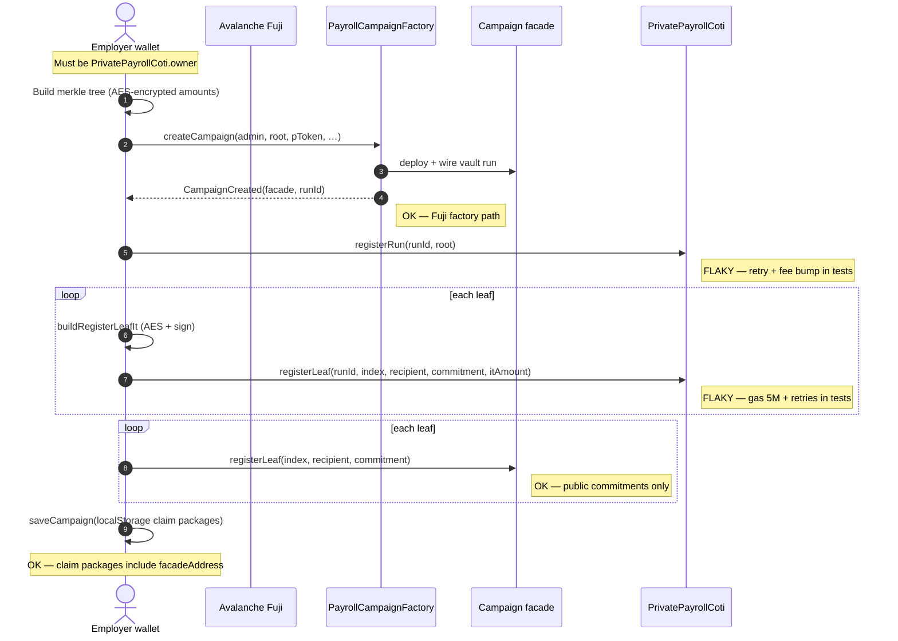
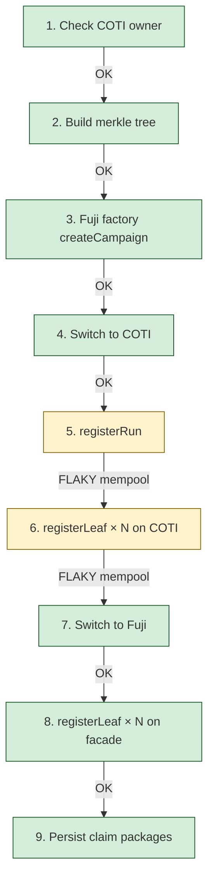
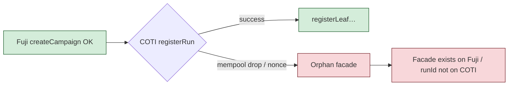

# Create campaign flow

**Status: working** on Avalanche Fuji + COTI testnet (addresses: iter08 redeploy
2026-07-20; reference facade runId `1`:
`0x401b9514a3CCA82c790d7F360F28C1B33F04227D`).

COTI mempool can drop `registerRun` / `registerLeaf` txs; the test helper retries with fee
bumps. The UI hook does not yet auto-retry — a dropped COTI tx leaves an **orphan facade**
on Fuji (factory succeeded, COTI roster incomplete).

---

## Sequence (happy path)



---

## Step status board



| Step | Where | Status | Notes |
|------|--------|--------|-------|
| Owner gate | COTI `owner()` | OK | Prevents orphan facades when wallet ≠ COTI owner |
| Merkle tree | local | OK | `buildPayrollMerkleTree` |
| `createCampaign` | Fuji factory | OK | Emits `CampaignCreated` |
| `registerRun` | COTI | FLAKY | Test helper `writeCotiContract` retries |
| `registerLeaf` (IT) | COTI | FLAKY | Needs `COTI_REGISTER_LEAF_GAS` + retries |
| `registerLeaf` | Fuji facade | OK | Public amount commitments |
| Local save | browser / test | OK | Packages now require `facadeAddress` |

---

## Failure modes we have seen



| Failure | Symptom | Recovery |
|---------|---------|----------|
| COTI tx dropped | Fuji facade + runId exist; COTI has no run | Create a new campaign (orphan is abandoned). Tests retry automatically. |
| Wrong COTI owner | Hook / test throws before factory | Use wallet that owns `PrivatePayrollCoti` |
| Wallet chain drift | Mid-flow “wrong network” | UI re-asserts chain before each write |

---

## Contracts / config

| Piece | Address / source |
|-------|------------------|
| Factory (Fuji) | `0x17cad9fce18ef750e8626c2d1ee9be97f3d375e5` |
| PrivatePayrollCoti | `0xeddbb52a6b92db6ba088c39a96dd0b1a76082ecb` |
| Reference facade (runId 1) | `src/config/contracts.ts` |

Addresses current as of the 2026-07-20 redeploy
(`deployments/production-payroll-avalancheFuji.json`); always prefer
`src/config/contracts.ts` over this table if they ever drift.

---

## How to verify

```bash
cd ui
npm run test:testnet -- tests/testnet/createCampaign.test.ts
```

Expect: factory create → COTI registerRun/leaves → facade leaves → local packages saved.
