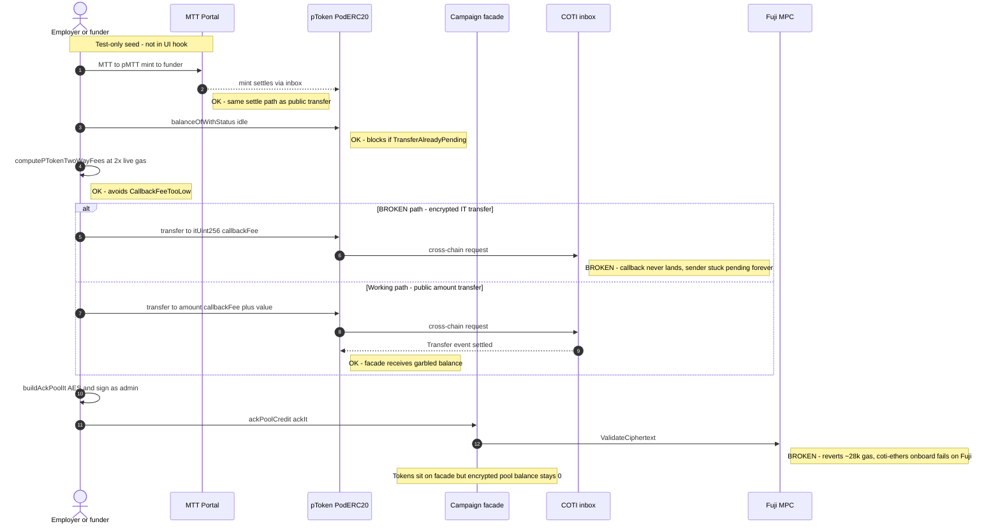
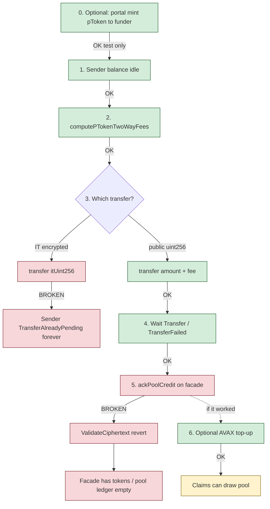

# Fund campaign flow

**Status: partial** — tokens can reach the facade; the encrypted pool ledger cannot be
acked, so claims still fail with `InsufficientPoolBalance`.

Latest example (funded tokens, **unacked** pool): facade
`0x5016E770670F1EfD7608cf87D21F98470d8cee50` (runId `14`).

---

## Sequence (intended vs actual)



---

## Step status board



| Step | Where | Status | Notes |
|------|--------|--------|-------|
| Portal MTT→pMTT mint | Fuji portal | OK | Used by fund test to seed funder |
| Idle sender check | pToken `balanceOfWithStatus` | OK | Hard-fails if stuck pending |
| Fee quote | `podFees.ts` | OK | **2× live Fuji gas**; stale ~0.3 gwei caused `CallbackFeeTooLow` |
| IT `transfer(to, it, fee)` | pToken | **BROKEN** | Never settle; bricks sender |
| Public `transfer(to, amount, fee)` | pToken | OK | Settles; amount is public |
| Settle wait | `Transfer` / `TransferFailed` logs | OK | Do not use receiver pending flag |
| `ackPoolCredit` | Facade + Fuji MPC | **BROKEN** | `ValidateCiphertext` reverts; Fuji onboard: `unable to onboard user` |
| AVAX top-up | Facade native | OK | Only after successful ack in UI |
| Claims after fund | Facade / vault | Blocked | Needs ack; else `InsufficientPoolBalance` |

---

## What works vs what breaks (summary)


### Root cause notes (current understanding)

1. **IT transfer stall** — Encrypted `transfer(to, itUint256, …)` requests leave the sender
   `pending` forever on Fuji↔COTI testnet. Public-amount overload uses the portal settle path
   and completes. UI + tests use the public path on purpose.

2. **`ackPoolCredit` MPC** — Building / submitting the IT for `ackPoolCredit` hits Fuji MPC
   validation (`ValidateCiphertext` ~28k gas revert). `coti-ethers` user onboard on Fuji also
   fails with `unable to onboard user`. Until MPC/onboard works for the employer AES key on
   Fuji, the encrypted pool ledger cannot be credited even though the facade holds pTokens.

3. **Who signs ack** — Admin/employer must call `ackPoolCredit` (not an ephemeral funder).
   Tests already use the employer wallet for this step; the failure is MPC validation, not
   access control.

---

## Code map

| Concern | File |
|---------|------|
| UI fund mutation | `src/hooks/useFundCampaign.ts` |
| Fee math (2× gas) | `src/lib/podFees.ts` |
| Test + portal seed + COTI retries | `tests/testnet/fundCampaign.test.ts`, `tests/testnet/helpers.ts` |
| Ack IT builder | `buildAckPoolIt` (shared with UI) |
| Fuji MPC gas override | `FUJI_MPC_IT_GAS` |

---

## How to verify

```bash
cd ui
npm run test:testnet -- tests/testnet/fundCampaign.test.ts
```

**Expected today**

- Portal mint: pass  
- Public transfer + settle: pass  
- `ackPoolCredit`: fail (`ValidateCiphertext` / onboard)  
- Claim path: blocked until ack works  

When ack is green, the same test should complete funding and leave a non-zero encrypted pool
balance readable via the facade’s pool views.
