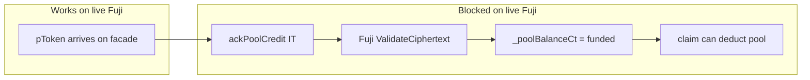
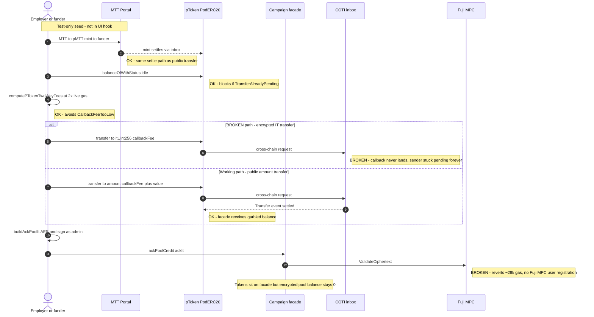
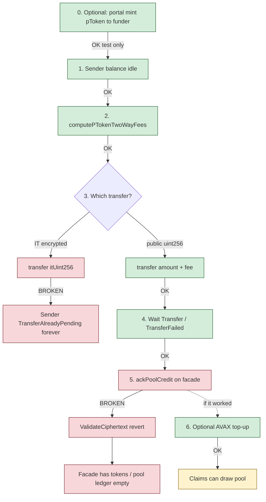

# Fund campaign flow

**Status: partial** — pTokens can sit on the facade; the campaign still cannot be *used*
(claims revert) because the encrypted pool ledger never gets credited.

Latest example (tokens on facade, **unacked** pool): `0x5016E770670F1EfD7608cf87D21F98470d8cee50`
(runId `14`).

---

## The problem (plain language)

Funding a PoD campaign is **two different ledgers**, not one transfer:

1. **pToken balance on the facade** — garbled ERC-20-style balance after a cross-chain
   settle. This part works today (public `transfer` + inbox callback).
2. **Encrypted pool ledger `_poolBalanceCt` on the facade** — what `claim` / `clawback`
   actually debit via `_deductPool`. This is **not** filled by the pToken transfer. The
   employer must call `ackPoolCredit(itUint256)`, which runs
   `MpcCore.validateCiphertext` **on Avalanche Fuji** and stores a network-key ciphertext.



**What breaks:** step `ackPoolCredit` → Fuji `ValidateCiphertext` reverts immediately
(~28k gas). The facade holds tokens, but `_poolBalanceCt` stays empty, so later claims hit
`InsufficientPoolBalance`.

**Why (and what is *not* wrong):** the AES key in repo-root `.env`
(`PRIVATE_AES_KEY_TESTNET`) **is** the correct key. Fund/ack already builds the IT with
that same value via `buildAckPoolIt({ aesKey: employerAesKey, … })`. There is no second
Fuji-only AES secret to put in `.env`.

Having the key locally is not enough. `ValidateCiphertext` on Fuji asks the **Fuji MPC
node** whether this account’s user key is registered for client-chain IT validation. We
only completed AccountOnboard on **COTI** testnet (that is where
`PRIVATE_AES_KEY_TESTNET` came from). Fuji has no working onboard path today, so the
*same* key encrypts a valid-looking IT that Fuji still rejects.

| Piece | Status |
|-------|--------|
| `.env` `PRIVATE_AES_KEY_TESTNET` | Correct key; used for ack IT + decrypting Fuji pToken balances |
| COTI AccountOnboard | Working — key was recovered / pinned here |
| Fuji MPC registration for that same key | Missing — `generateOrRecoverAes` on Fuji RPC → `unable to onboard user` |
| Result | Fuji `ValidateCiphertext` reverts (~28k gas) even though the IT was built with `.env` |

COTI onboarding in `@coti-io/coti-ethers` targets AccountOnboard
`0xe1dA9B857E1196D0BeDBE46960586cBc3F909C17` (docs also list
`0x536A67f0…` as AccountOnboard on COTI). Pointing that flow at the Fuji RPC does not
register the user for Fuji MPC. Decrypting Fuji pToken balances with the COTI `.env` key
works; Fuji accepting a signed IT in `validateCiphertext` is a separate on-chain/MPC
registration step.

This is **not** a wrong `.env` key, wrong function selector, wrong signer (employer vs
funder), or missing gas limit bug. UI/test IT shape matches `sablier-payroll-pod`:
`ackPoolCredit(((uint256,uint256),bytes))`, employer signs, `FUJI_MPC_IT_GAS` is set.

**Why simCOTI passes but live Fuji does not:** pod tests call `registerUserOnDualSim` /
`onboardSimUser(..., sepoliaViem)` so the **same** AES key bytes are registered on
**both** the AVAX surrogate and simCOTI (`ITERATION_07_GAPS.md`). Live Fuji has no
equivalent “register this `.env` key on the client chain” step today.

**Knock-on:** `claim` and `clawback` also call `ValidateCiphertext` on Fuji. Even after
tokens land, a full live claim path stays blocked until Fuji MPC user registration works
(or contracts are redesigned to avoid Fuji IT validate for pool credit).

**Secondary breakage (transfer):** encrypted `pToken.transfer(to, itUint256, …)` leaves the
sender `TransferAlreadyPending` forever on Fuji↔COTI testnet. The UI/tests use the public
`transfer(to, uint256, callbackFee)` overload so the facade can still receive tokens. That
workaround does **not** fix ack.

---

## Sequence (intended vs actual)



---

## Step status board



| Step | Where | Status | Notes |
|------|--------|--------|-------|
| Portal MTT→pMTT mint | Fuji portal | OK | Used by fund test to seed funder |
| Idle sender check | pToken `balanceOfWithStatus` | OK | Hard-fails if stuck pending |
| Fee quote | `podFees.ts` | OK | **2× live Fuji gas**; stale ~0.3 gwei caused `CallbackFeeTooLow` |
| IT `transfer(to, it, fee)` | pToken | **BROKEN** | Never settle; bricks sender |
| Public `transfer(to, amount, fee)` | pToken | OK | Settles; amount is public |
| Settle wait | `Transfer` / `TransferFailed` logs | OK | Do not use receiver pending flag |
| `ackPoolCredit` | Facade + Fuji MPC | **BROKEN** | No Fuji MPC user registration → `ValidateCiphertext` revert |
| AVAX top-up | Facade native | OK | Only after successful ack in UI |
| Claims after fund | Facade / vault | Blocked | Needs ack; else `InsufficientPoolBalance` |

---

## What works vs what breaks (summary)


### Reference: how `sablier-payroll-pod` funds (sim)

Same contract design the live UI targets (`PayrollCampaignFacade.ackPoolCredit`):

1. Employer encrypted `pToken.transfer(facade, it, fee)` (+ sync round-trip)
2. `buildAckPoolIt(facade, employer, amount)` bound to
   `ackPoolCredit(((uint256,uint256),bytes))`
3. `facade.ackPoolCredit(ackIt)` → `validateCiphertext` → `offBoard` → `_poolBalanceCt`
4. Native ETH top-up on facade for later inbox fees

Native `sablier-payroll` (non-PoD) only does plain ERC20 `mint` + `transfer` — no
`ackPoolCredit`, no MPC. Not a drop-in substitute for the PoD facade.

### What we can / cannot do in the UI alone

| Option | Feasible? | Notes |
|--------|-----------|-------|
| Keep public pToken transfer + retry ack | No | Ack still needs Fuji `ValidateCiphertext` |
| Match pod encrypted transfer + ack | No | Encrypted transfer stalls; ack still needs Fuji MPC |
| Onboard employer on Fuji via coti-ethers | Blocked | `unable to onboard user` on Fuji RPC |
| Run fund E2E on simCOTI (`sablier-payroll-pod`) | Yes | Green with dual-sim onboard |
| Platform: Fuji AccountOnboard + MPC user keys | Required for live | Then ack/claim ITs can validate |
| Contract redesign (credit pool from pToken callback / drop Fuji IT validate) | Possible later | Needs new deploy; flagged as prod gap in iteration 07 |

---

## Code map

| Concern | File |
|---------|------|
| UI fund mutation | `src/hooks/useFundCampaign.ts` |
| Fee math (2× gas) | `src/lib/podFees.ts` |
| Ack IT builder | `src/lib/buildPayrollIt.ts` (`buildAckPoolIt`) |
| Test + portal seed | `tests/testnet/fundCampaign.test.ts`, `tests/testnet/helpers.ts` |
| Fuji MPC gas override | `FUJI_MPC_IT_GAS` in `podFees.ts` |
| Facade contract (source of truth) | `pod-dapp-ports/sablier-payroll-pod/contracts-src/avax/PayrollCampaignFacade.sol` |
| Pod fund reference | `pod-dapp-ports/sablier-payroll-pod/test/lib/pod-scenario.ts` (`fundCampaignOnFacade`) |
| Dual-sim onboard (why sim works) | `pod-ecosystem-integration/test/sim-coti/sim-coti-utils.ts` |
| Iteration write-up | `pod-dapp-ports/sablier-payroll-pod/docs/iterations/ITERATION_07_GAPS.md` |

---

## How to verify

```bash
cd ui
npm run test:testnet -- tests/testnet/fundCampaign.test.ts
```

**Expected today**

- Portal mint: pass
- Public transfer + settle: pass
- `ackPoolCredit`: fail (`ValidateCiphertext` / no Fuji MPC user registration)
- Claim path: blocked until ack works

When ack is green, the same test should complete funding with a non-zero encrypted pool
ledger so claims can `_deductPool` successfully.
