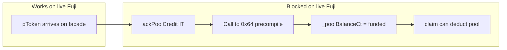
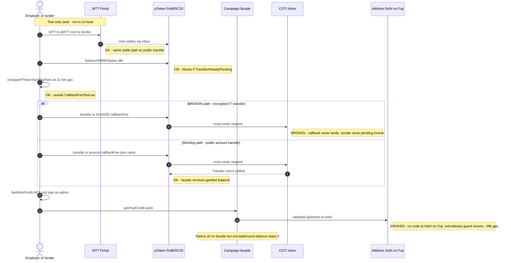
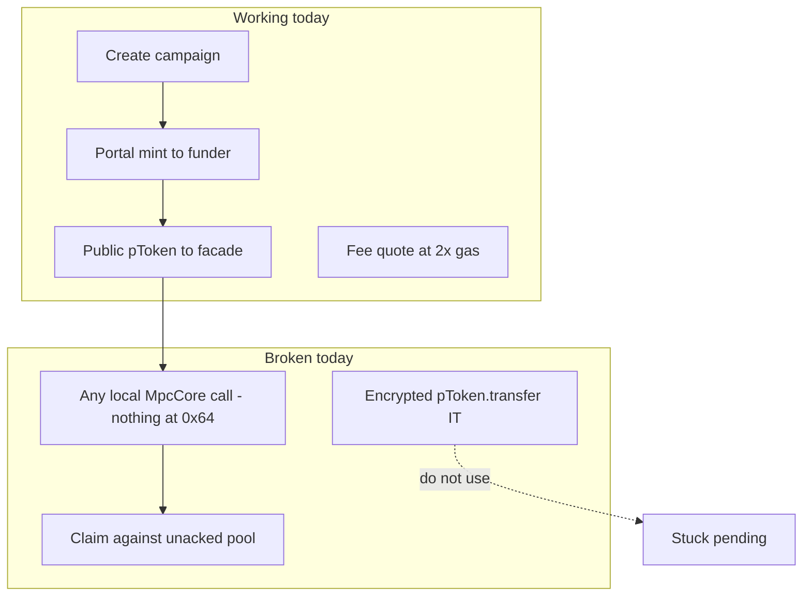

# Fund campaign flow

**Status: partial** — pTokens can sit on the facade; the campaign still cannot be *used*
(claims revert) because the encrypted pool ledger never gets credited.

Latest example (tokens on facade, **unacked** pool): `0x5016E770670F1EfD7608cf87D21F98470d8cee50`
(runId `14`).

---

## The problem (plain language)

Funding a PoD campaign is **two different ledgers**, not one transfer:

1. **pToken balance on the facade** — garbled ERC-20-style balance after a cross-chain
   settle. This part works today (public `transfer` + inbox callback).
2. **Encrypted pool ledger `_poolBalanceCt` on the facade** — what `claim` / `clawback`
   actually debit via `_deductPool`. This is **not** filled by the pToken transfer. The
   employer must call `ackPoolCredit(itUint256)`, which runs
   `MpcCore.validateCiphertext` **locally on Avalanche Fuji**.



**What breaks — root cause (2026-07-19, proven on-chain):** every `MpcCore` operation
compiles into a high-level Solidity call to `ExtendedOperations(address(0x64))`
(`MPC_PRECOMPILE` in `MpcInterface.sol`). That address is a gcEVM precompile that only
exists on COTI's chain. On live Fuji, `eth_getCode(0x…64)` returns `0x` — **there is no
code at that address at all** — so Solidity's extcodesize guard reverts the call
immediately (~28k gas: 21k base + calldata + dispatch up to the first external call),
*before* the ciphertext, signature, or any notion of user registration is ever read.

**Proof (reproducible, see "How to verify"):** a plain `eth_call` of `ackPoolCredit` on
the live facade with a **garbage** IT (`high=1, low=2, sig=0x1111…`) reverts with empty
data. The *identical* call with an `eth_call` state override placing 15 bytes of mock
code at `0x64` **succeeds**. The only variable is code existing at 0x64 — no AES key, IT
format, signer, or MPC-registration change can ever make the live call pass.

**What is *not* wrong** (all previously suspected): `.env` `PRIVATE_AES_KEY_TESTNET` is
the correct key (its ITs validate fine on COTI), the IT shape matches the pod reference
(`ackPoolCredit(((uint256,uint256),bytes))`), the employer signs, `FUJI_MPC_IT_GAS` is
set. The earlier root-cause note "missing Fuji MPC user registration" was **also wrong**:
registration is the *sim-world* precondition; on live Fuji there is nothing at 0x64 for a
registration to live on. `generateOrRecoverAes` → "unable to onboard user" on the Fuji
RPC is a symptom of the same absence, not a separate missing platform step. Likewise
"Fuji eth_estimateGas cannot model validateCiphertext" was off — estimation fails because
the call genuinely always reverts; the explicit gas limit just moved the failure on-chain.

| Piece | Status |
|-------|--------|
| `.env` `PRIVATE_AES_KEY_TESTNET` | Correct key; validates ITs on COTI + decrypts Fuji pToken balances |
| COTI AccountOnboard | Working — key was recovered / pinned here |
| Code at `0x…64` on live Fuji | **Absent** (`eth_getCode` → `0x`) — every local `MpcCore` op reverts at the extcodesize guard |
| "Fuji MPC user registration" | Not a real thing on a vanilla client chain — see the SDK pattern below |
| Result | `ackPoolCredit` (and `claim` / `clawback`) can never execute on live Fuji as deployed |

**Why simCOTI passes but live Fuji does not:** the sim *places* a `SimExtendedOperations`
contract at address 0x64 (`viem.getContractAt("SimExtendedOperations", MPC_PRECOMPILE)`)
and `simRegisterUserKey` registers AES keys **on that contract** (`registerUserOnDualSim`
does it on both the AVAX surrogate and simCOTI). Registration only matters once code
exists at 0x64; on a public chain nothing can ever be deployed to a precompile-range
address.

---

## The official live pattern (coti-sdk-pod)

[`pod-method-call.ts`](https://github.com/coti-io/coti-sdk-pod/blob/main/src/pod-method-call.ts)
in the official SDK shows that client chains are **never** meant to run MPC locally:

- Encrypted inputs are built by COTI's off-chain **encryption service**
  (`CotiPodCrypto.encrypt` → HTTP `buildEncryptedInputs`), bound to
  `{contractAddress, functionSelector, userAddress}` — not by the user's local AES key.
- Calls route through the shared CREATE3 **Inbox**
  `0xAb625bE229F603f6BBF964474AFf6d5487e364De` (same address on Fuji 43113, Sepolia, and
  COTI testnet), paying two-way fees via `calculateTwoWayFeeRequiredInLocalToken`.
- The MPC work executes **on COTI**; results return via callback
  (`MessageSent` / requestId).

That is exactly how the official pMTT PodERC20 works on Fuji — which is why token
transfers settle while the facade's local `MpcCore` functions cannot.

**Knock-on (fix scope):** the deployed facade bytecode contains the `OnBoard`,
`CheckedSub`, and `Decrypt` selectors — `_deductPool`, `claim`, and `clawback` all call
0x64 too. Fixing ack alone is not enough; every claim would revert the same way. The
claim payout leg additionally uses the encrypted `pToken.transfer(to, itUint256, …)`
overload, which bricks senders (below). **Any real fix must remove all local MpcCore
usage from the Fuji-side contracts.**

**Secondary breakage (transfer):** encrypted `pToken.transfer(to, itUint256, …)` leaves the
sender `TransferAlreadyPending` forever on Fuji↔COTI testnet. The UI/tests use the public
`transfer(to, uint256, callbackFee)` overload so the facade can still receive tokens. That
workaround does **not** fix ack.

---

## Sequence (intended vs actual)



---

## Step status board


| Step | Where | Status | Notes |
|------|--------|--------|-------|
| Portal MTT→pMTT mint | Fuji portal | OK | Used by fund test to seed funder |
| Idle sender check | pToken `balanceOfWithStatus` | OK | Hard-fails if stuck pending |
| Fee quote | `podFees.ts` | OK | **2× live Fuji gas**; stale ~0.3 gwei caused `CallbackFeeTooLow` |
| IT `transfer(to, it, fee)` | pToken | **BROKEN** | Never settle; bricks sender |
| Public `transfer(to, amount, fee)` | pToken | OK | Settles; amount is public |
| Settle wait | `Transfer` / `TransferFailed` logs | OK | Do not use receiver pending flag |
| `ackPoolCredit` | Facade → `0x…64` | **BROKEN** | No code at 0x64 on Fuji → extcodesize revert before any validation |
| AVAX top-up | Facade native | OK | Only after successful ack in UI |
| Claims after fund | Facade / vault | Blocked | `_deductPool` also calls 0x64 — same revert even if ack were fixed |

---

## What works vs what breaks (summary)



### Reference: how `sablier-payroll-pod` funds (sim)

Same contract design the live UI targets (`PayrollCampaignFacade.ackPoolCredit`):

1. Employer encrypted `pToken.transfer(facade, it, fee)` (+ sync round-trip)
2. `buildAckPoolIt(facade, employer, amount)` bound to
   `ackPoolCredit(((uint256,uint256),bytes))`
3. `facade.ackPoolCredit(ackIt)` → `validateCiphertext` → `offBoard` → `_poolBalanceCt`
4. Native ETH top-up on facade for later inbox fees

This only works in sim because `SimExtendedOperations` is planted at 0x64. Native
`sablier-payroll` (non-PoD) only does plain ERC20 `mint` + `transfer` — no
`ackPoolCredit`, no MPC. Not a drop-in substitute for the PoD facade.

### Fix options (ranked)

| # | Option | Feasible? | Notes |
|---|--------|-----------|-------|
| 1 | **PoD-canonical redesign**: move `_poolBalanceCt` + `_deductPool` to COTI (`PrivatePayrollCoti`); facade forwards ack/claim through the Fuji inbox (`PodContract.encryptAndCallMethod`, encryption-service ITs); COTI callbacks update Fuji state | **Yes — the real fix** | New deploy; matches how PodERC20 itself works. Employer's COTI onboarding + `.env` AES already validate ITs on COTI |
| 2 | Drop encrypted ack; credit pool from the pToken settle callback | Yes — pairs with 1 | Fund path is already the public-amount transfer, so the amount is public on the wire anyway; deletes `ackPoolCredit` as a concept |
| 3 | Demo-only shim: deploy a `SimExtendedOperations`-style validator at a normal Fuji address; recompile with `MPC_PRECOMPILE` repointed | Demo only — **insecure** | AES keys sit in public contract storage, readable by anyone; must never be described as private |
| 4 | E2E today: Anvil/Hardhat fork of Fuji with `setCode` at 0x64 (or keep simCOTI) | Yes — zero deploys | Same trick as the eth_call state-override proof; unblocks fund→ack→claim in CI now |
| 5 | Wait for "Fuji AccountOnboard / MPC user keys" | **Not viable** | Nothing will ever appear at hardcoded 0x64 on a chain COTI doesn't control; the SDK's inbox + encryption-service design shows this is intentional |

Also confirmed not viable in the UI alone: retrying ack with the public-transfer flow, or
matching the pod encrypted-transfer flow — both still dead-end at the missing 0x64 code.

---

## Code map

| Concern | File |
|---------|------|
| UI fund mutation | `src/hooks/useFundCampaign.ts` |
| Fee math (2× gas) | `src/lib/podFees.ts` |
| Ack IT builder | `src/lib/buildPayrollIt.ts` (`buildAckPoolIt`) |
| Test + portal seed | `tests/testnet/fundCampaign.test.ts`, `tests/testnet/helpers.ts` |
| Fuji MPC gas override | `FUJI_MPC_IT_GAS` in `podFees.ts` |
| Facade contract (source of truth) | `pod-dapp-ports/sablier-payroll-pod/contracts-src/avax/PayrollCampaignFacade.sol` |
| `MPC_PRECOMPILE = 0x64` | `pod-dapp-ports/sablier-payroll-pod/contracts/utils/mpc/MpcInterface.sol` |
| Pod fund reference | `pod-dapp-ports/sablier-payroll-pod/test/lib/pod-scenario.ts` (`fundCampaignOnFacade`) |
| Sim precompile at 0x64 (why sim works) | `pod-ecosystem-integration/test/sim-coti/sim-coti-utils.ts` (`registerUserOnSim`) |
| Official client-chain call pattern | `coti-io/coti-sdk-pod` `src/pod-method-call.ts`, `src/consts.ts` |
| Iteration write-up | `pod-dapp-ports/sablier-payroll-pod/docs/iterations/ITERATION_07_GAPS.md` |

---

## How to verify

### Root-cause proof (no gas spent)

```bash
# 1) Nothing lives at the MPC precompile address on live Fuji:
curl -s -X POST https://api.avax-test.network/ext/bc/C/rpc -H 'Content-Type: application/json' \
  -d '{"jsonrpc":"2.0","id":1,"method":"eth_getCode","params":["0x0000000000000000000000000000000000000064","latest"]}'
# → {"result":"0x"}
```

```python
# 2) ackPoolCredit with a GARBAGE IT: reverts plain, succeeds once code exists at 0x64.
import json, urllib.request

def rpc(method, params):
    req = urllib.request.Request('https://api.avax-test.network/ext/bc/C/rpc',
        data=json.dumps({'jsonrpc':'2.0','id':1,'method':method,'params':params}).encode(),
        headers={'Content-Type':'application/json'})
    return json.loads(urllib.request.urlopen(req).read())

w = lambda x: format(x, '064x')
sig = b'\x11' * 65
data = ('0x649c71cb' + w(0x20) + w(1) + w(2) + w(0x60) + w(len(sig))
        + sig.hex().ljust(192, '0'))
call = {'from': '0x0000000000000000000000000000000000001234',
        'to': '0x5016E770670F1EfD7608cf87D21F98470d8cee50',
        'data': data, 'gas': '0x2dc6c0'}

print(rpc('eth_call', [call, 'latest']))
# → execution reverted, data 0x  (the live failure)

mock = '0x6001600052600260205260406000f3'  # returns (1, 2) to any call
print(rpc('eth_call', [call, 'latest',
    {'0x0000000000000000000000000000000000000064': {'code': mock}}]))
# → {"result":"0x"}  (succeeds — only difference is code at 0x64)
```

### Flow test

```bash
cd ui
npm run test:testnet -- tests/testnet/fundCampaign.test.ts
```

**Expected today**

- Portal mint: pass
- Public transfer + settle: pass
- `ackPoolCredit`: fail (no code at `0x…64` on Fuji — extcodesize revert, ~28k gas)
- Claim path: blocked — `_deductPool` hits the same missing precompile

The npm test can only go green against a chain where 0x64 answers: simCOTI, a Fuji fork
with `setCode` at 0x64 (option 4), or after the contracts are redesigned to route MPC
through the COTI inbox (option 1).
