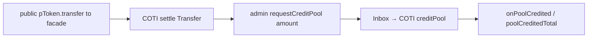
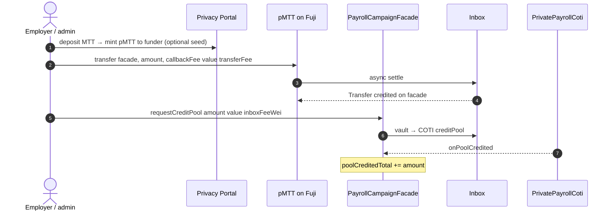

# Fund campaign flow

**Status: ready to retest on live** — iter08 redeploy (2026-07-19) removes Fuji-local
`MpcCore` / `ackPoolCredit`. Fund path is now PoD-shaped:
`public pToken.transfer(facade) → requestCreditPool → COTI creditPool → onPoolCredited`.

Source of truth: [coti-io/pod-dapp-ports](https://github.com/coti-io/pod-dapp-ports)
`sablier-payroll-pod` · architecture `iter08-thin-fuji-facade` ·
[ITERATION_08_GAPS.md](https://github.com/coti-io/pod-dapp-ports/blob/main/sablier-payroll-pod/docs/iterations/ITERATION_08_GAPS.md).

Reference facade from the production manifest (runId `1`):
`0x458851b4f87C9B2cdb53A9Fb0DB3f4189584dF67`.

---

## What changed (iter08)

| Before (broken on live Fuji) | After (iter08) |
|------------------------------|----------------|
| `ackPoolCredit(itUint256)` → local `MpcCore` at `0x64` | **Deleted** — Fuji facade has no `MpcCore` calls |
| Encrypted `_poolBalanceCt` on Fuji | COTI `creditPool` + public `poolCreditedTotal` marker |
| Claim deducted pool via local `_deductPool` | Claim → COTI `verifyAndCredit` → public `payoutTo(to, uint256)` |



simCOTI already passes create→fund→claim e2e (39/39). Live Fuji fund is what this UI
doc + `tests/testnet/fundCampaign.test.ts` re-evaluate.

---

## Live deploy (Avalanche Fuji + COTI testnet)

Manifest snapshot (`updatedAt` `2026-07-19T18:26:33.219Z`, `mode` production):

| Piece | Address |
|-------|---------|
| `payrollCampaignFactory` | `0x4d2613a8fa165a54171a2d8ba7befe0f9afcbdbd` |
| `payrollVault` | `0x5befe6a1a38881eb1e2be092c1dd730f45811801` |
| `payrollClaimStore` | `0xea79652ea1c5a053e86f9433d86016a1358b6bb2` |
| `payrollCampaignFacade` (runId 1) | `0x458851b4f87C9B2cdb53A9Fb0DB3f4189584dF67` |
| `privatePayrollCoti` | `0x0483a18becb2b1311b7fee7be7168bc2356f3b8a` |
| `comptroller` | `0xc444ea253dfc8ab8fd9eacd4c8e140975d891eb0` |
| `pToken` (pMTT) | `0x8F34570CEAD49273D5DA8A0E25e728eCC28af267` |
| `underlying` (MTT) | `0x328e70e1c52662cd5f19f824fcb8b463d77a6686` |
| `privacyPortal` | `0x64D99D761aC68D1a495B4f7E5bE7277586EDFE78` |
| `inbox` (both chains) | `0xAb625bE229F603f6BBF964474AFf6d5487e364De` |
| `mpcExecutor` | `0x68e151b78d51cea01eef6ee354579e044606a739` |
| `owner` / `cotiOwner` | `0xdf9f8fca4591227c092fcbab45a846c19fb6d1ae` |

Fees from the same manifest (also readable on the wired facade):

| Fee | Wei |
|-----|-----|
| `inboxFeeWei` | `1000968000000001` |
| `callbackFeeWei` | `979128000000001` |
| `pTokenTransferFeeWei` | `181739871082847` |
| `pTokenCallbackFeeWei` | `175012102621895` |

Wired in the UI: `src/config/contracts.ts`.

---

## End-to-end fund steps



1. **Idle sender** — funder’s `balanceOfWithStatus` must not be `pending`.
2. **Public fund transfer** — `pToken.transfer(facade, amount, pTokenCallbackFeeWei)` with
   `value: pTokenTransferFeeWei` (compute via `computePTokenTwoWayFees`).
3. **Wait settle** — `Transfer` event `from=funder to=facade` (not merely “pending cleared”).
4. **Credit pool** — campaign **admin** calls `requestCreditPool(amount)` with
   `value: facade.inboxFeeWei()` (admin-only).
5. **Wait callback** — `PoolCredited` and/or `poolCreditedTotal >= previous + amount`.
6. **Optional** — native AVAX top-up on the facade for later inbox spends.

UI: `src/hooks/useFundCampaign.ts`  
Test: `tests/testnet/fundCampaign.test.ts`  
(`npm run test:testnet` from `ui/`, with repo-root `.env` `PRIVATE_KEY3` + AES keys).

---

## Status matrix (post-iter08)

| Step | Live Fuji (prior) | Expected now | Notes |
|------|-------------------|--------------|-------|
| Create campaign (factory) | OK | OK | New factory address; create still needs COTI register |
| Portal deposit / mint | OK | OK | Public-amount mint |
| Public `pToken.transfer` settle | OK | OK | Preferred fund path |
| Encrypted `pToken.transfer(itUint256)` | BROKEN | BROKEN | No callback in 300s retest — leave pending; do not use for fund |
| `ackPoolCredit` + Fuji `0x64` | BROKEN | **N/A removed** | Root cause of prior “partial” status |
| `requestCreditPool` → COTI → `PoolCredited` | N/A | **Retest** | Wired in UI/tests; sim green |
| Claim / public `payoutTo` | Blocked by pool | **Retest after fund** | Claim path also redesigned in iter08 |

---

## Why the old fund path failed (historical)

The pre-iter08 facade was **COTI-native code on a PoD client chain**: `ackPoolCredit`
called `MpcCore` at `0x…64`, which has **no code** on live Fuji. simCOTI hid this by
injecting `SimExtendedOperations` at `0x64`. That was an architecture bug, not a wrong
AES key. Full autopsy lived in earlier revisions of this doc; iter08 is the fix
documented in pod-dapp-ports.

---

## Remaining risks

1. **IT transfer settle** — encrypted amount transfers still stick senders `pending` on
   live Fuji↔COTI. Fund must keep using the **public-amount** overload.
2. **Live callback latency** — both pToken settle and `requestCreditPool` need inbox
   mining; UI/tests wait up to 300s.
3. **Admin vs funder** — anyone can transfer pTokens to the facade; only `admin` can
   `requestCreditPool`. The UI hook uses the connected wallet for both steps.
4. **Facade native AVAX** — each claim spends `inboxFeeWei` from the **facade balance**
   (not the claimant’s msg.value). Fund UI tops up 0.1 AVAX by default; campaigns funded
   only via the test harness may have `0` and need a manual top-up before claim.
5. **Stuck pending accounts** — rotate `PAYROLL_TEST_FUNDER_SALT` if a prior failed IT
   transfer locked a funder.

---

## Quick verify (on-chain)

```bash
# Factory → vault (iter08)
cast call 0x4d2613a8fa165a54171a2d8ba7befe0f9afcbdbd "vault()(address)" \
  --rpc-url https://api.avax-test.network/ext/bc/C/rpc
# → 0x5befe6a1a38881eb1e2be092c1dd730f45811801

# Reference facade: no ackPoolCredit; has requestCreditPool + poolCreditedTotal
cast call 0x458851b4f87C9B2cdb53A9Fb0DB3f4189584dF67 "inboxFeeWei()(uint256)" \
  --rpc-url https://api.avax-test.network/ext/bc/C/rpc
cast call 0x458851b4f87C9B2cdb53A9Fb0DB3f4189584dF67 "poolCreditedTotal()(uint256)" \
  --rpc-url https://api.avax-test.network/ext/bc/C/rpc

# COTI twin
cast call 0x0483a18becb2b1311b7fee7be7168bc2356f3b8a "owner()(address)" \
  --rpc-url https://testnet.coti.io/rpc
```

After a successful fund of a new campaign, `poolCreditedTotal` on that facade should
equal the credited amount (public marker; the encrypted pool lives on COTI).
