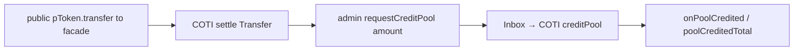
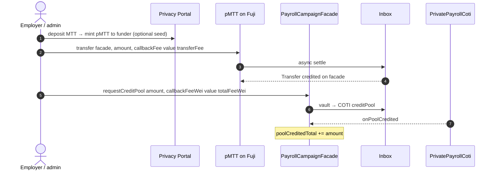

# Fund campaign flow

**Status: confirmed working on live (2026-07-20); addresses redeployed again
2026-07-22 (same iter08-thin-fuji-facade architecture, not yet re-verified live).**
iter08 redeploy removes Fuji-local `MpcCore` / `ackPoolCredit`. Fund path is PoD-shaped:
`public pToken.transfer(facade) → requestCreditPool → COTI creditPool → onPoolCredited`.
The 2026-07-20 redeploy additionally removed every baked-in fee constant
(`setInboxFees` / `inboxFeeWei` / `payoutCallbackFeeWei` are gone from the contracts) —
`requestCreditPool` now takes a second `callbackFeeWei` argument, both it and the
`msg.value` total quoted live via `PayrollVault.estimateFee()`. Verified end-to-end via
`tests/testnet/claimCampaign.test.ts` (create → fund → claim in one run, 146s, first try
against the 2026-07-20 deploy).

Source of truth: [coti-io/pod-dapp-ports](https://github.com/coti-io/pod-dapp-ports)
`sablier-payroll-pod` · architecture `iter08-thin-fuji-facade` ·
[ITERATION_08_GAPS.md](https://github.com/coti-io/pod-dapp-ports/blob/main/sablier-payroll-pod/docs/iterations/ITERATION_08_GAPS.md).

Reference facade from the production manifest (runId `1`):
`0x5EC2693A0f014D32917A9801999B07011b1A9030`.

---

## What changed (iter08)

| Before (broken on live Fuji) | After (iter08) |
|------------------------------|----------------|
| `ackPoolCredit(itUint256)` → local `MpcCore` at `0x64` | **Deleted** — Fuji facade has no `MpcCore` calls |
| Encrypted `_poolBalanceCt` on Fuji | COTI `creditPool` + public `poolCreditedTotal` marker |
| Claim deducted pool via local `_deductPool` | Claim → COTI `verifyAndCredit` → public `payoutTo(to, uint256)` |



simCOTI already passes create→fund→claim e2e (39/39). Live Fuji fund is what this UI
doc + `tests/testnet/fundCampaign.test.ts` re-evaluate.

---

## Live deploy (Avalanche Fuji + COTI testnet)

Manifest snapshot (`updatedAt` `2026-07-22T08:42:57.415Z`, `mode` production):

| Piece | Address |
|-------|---------|
| `payrollCampaignFactory` | `0x056242ccb7c71165ba0c6e8d1a9b2330ec6aefd0` |
| `payrollVault` | `0x41560d11e83369b24c9020a8ec59de98935be377` |
| `payrollClaimStore` | `0xd4418977eaa75de172157b456bfb63c1cff297a9` |
| `payrollCampaignFacade` (runId 1) | `0x5EC2693A0f014D32917A9801999B07011b1A9030` |
| `privatePayrollCoti` | `0x81aa3b52ffcbb62bc4391008ceeb0965c0de8640` |
| `comptroller` | `0xaaef4e27ab0213b826a0db994122f971aefafdff` |
| `pToken` (pMTT) | `0xFC6283a9000d7D5Cf8A058A04A9ED90265Af1634` |
| `underlying` (MTT) | `0x328e70e1c52662cd5f19f824fcb8b463d77a6686` |
| `privacyPortal` | `0xf4100d21eB4B1a66aDde58A01D1E32356F268b3F` |
| `inbox` (both chains) | `0x3b8B70819f27e0438cBcE7f31894f799da52648F` |
| `mpcExecutor` | `0x6804961167c3c8ef2bf6839ddcf51ec1fbe800c3` |
| `owner` / `cotiOwner` | `0xdf9f8fca4591227c092fcbab45a846c19fb6d1ae` |

## Fees — no stored constants

> **iter10 update (2026-07-22 deploy):** `PayrollVault.estimateFee()` itself is now GONE —
> nothing is quoted on-chain anymore. `claim`/`claimTo` take four caller-quoted fee args
> (`inboxTotalFeeWei, inboxCallbackFeeWei, pTokenTotalFeeWei, pTokenCallbackFeeWei`) and
> `clawback`/`requestClawback` gained the pToken pair; the vault escrows the pToken quote
> per-request and pays the payout callback's public `pToken.transfer` from its own AVAX
> float (`payoutTo(to, amount, callbackFeeWei)`). The verify IT must be signed by the live
> network miner (tx.origin of COTI `batchProcessRequests`) — see `buildVerifyItWithSigner`.
> The description below documents the older 07-20/07-21 deploys.

The 2026-07-19 manifest still had baked-in fee constants (`inboxFeeWei`,
`callbackFeeWei`, `pTokenTransferFeeWei`, `pTokenCallbackFeeWei`) readable directly off
the vault/facade. **The 2026-07-20 redeploy removed all of them** —
`PayrollVault.setInboxFees`/`inboxFeeWei`/`payoutCallbackFeeWei` no longer exist on the
contract at all. In their place:

- `PayrollVault.estimateFee()` — a live view function returning
  `(totalFeeWei, targetFeeWei, callbackFeeWei)`, computed from the inbox's oracle
  prices × `tx.gasprice` at call time. It reads `tx.gasprice` implicitly, so a bare
  `eth_call` (which defaults to gas price `0`) returns all zeros — the caller must
  supply a real gas price.
- Since viem's `readContract` has no way to override an `eth_call`'s gas price, the UI
  doesn't call `estimateFee()` directly. `src/lib/podFees.ts`'s `estimateVaultTwoWayFees`
  instead calls the inbox's underlying `calculateTwoWayFeeRequiredInLocalToken` the same
  way `computePTokenTwoWayFees` already did for pToken fees — gas price passed as an
  explicit function argument, using the vault's own `FEE_ESTIMATE_*` size/gas constants
  (`4096` bytes / `600_000` gas for both legs) — then pads the result 5%.
- `requestCreditPool`/`clawback` don't recompute fees on-chain the way claims do (see
  below), so the caller must pass the *exact* `callbackFeeWei` alongside `msg.value` —
  get both from the same `estimateVaultTwoWayFees()` call.

Wired in the UI: `src/config/contracts.ts` (addresses), `src/lib/podFees.ts` (fees).

---

## End-to-end fund steps



1. **Idle sender** — funder’s `balanceOfWithStatus` must not be `pending`.
2. **Public fund transfer** — `pToken.transfer(facade, amount, pTokenCallbackFeeWei)` with
   `value: pTokenTransferFeeWei` (compute via `computePTokenTwoWayFees`).
3. **Wait settle** — `Transfer` event `from=funder to=facade` (not merely “pending cleared”).
4. **Credit pool** — campaign **admin** calls `requestCreditPool(amount, callbackFeeWei)`
   with `value: totalFeeWei` (both quoted live via `estimateVaultTwoWayFees`; admin-only).
5. **Wait callback** — `PoolCredited` and/or `poolCreditedTotal >= previous + amount`.
6. **Optional** — native AVAX top-up on the facade for later inbox spends.

UI: `src/hooks/useFundCampaign.ts`  
Test: `tests/testnet/fundCampaign.test.ts`  
(`npm run test:testnet` from `ui/`, with repo-root `.env` `PRIVATE_KEY3` + AES keys).

---

## Status matrix (post-iter08)

| Step | Status | Notes |
|------|--------|-------|
| Create campaign (factory) | OK | Create still needs COTI register |
| Portal deposit / mint | OK | Public-amount mint |
| Public `pToken.transfer` settle | OK | Preferred fund path |
| Encrypted `pToken.transfer(itUint256)` | BROKEN | No callback in 300s retest — leave pending; do not use for fund |
| `ackPoolCredit` + Fuji `0x64` | **N/A removed** | Root cause of prior “partial” status; function no longer exists on the facade at all as of 2026-07-20 |
| `requestCreditPool` → COTI → `PoolCredited` | **OK** | Confirmed live 2026-07-20 (2-arg signature: `amount, callbackFeeWei`) |
| Claim / public `payoutTo` | **OK** | Fixed 2026-07-20 — see [claimCampaign.md](./claimCampaign.md) |

---

## Why the old fund path failed (historical)

The pre-iter08 facade was **COTI-native code on a PoD client chain**: `ackPoolCredit`
called `MpcCore` at `0x…64`, which has **no code** on live Fuji. simCOTI hid this by
injecting `SimExtendedOperations` at `0x64`. That was an architecture bug, not a wrong
AES key. Full autopsy lived in earlier revisions of this doc; iter08 is the fix
documented in pod-dapp-ports.

---

## Remaining risks

1. **IT transfer settle** — encrypted amount transfers still stick senders `pending` on
   live Fuji↔COTI. Fund must keep using the **public-amount** overload.
2. **Live callback latency** — both pToken settle and `requestCreditPool` need inbox
   mining; UI/tests wait up to 300s.
3. **Admin vs funder** — anyone can transfer pTokens to the facade; only `admin` can
   `requestCreditPool`. The UI hook uses the connected wallet for both steps.
4. **Facade native AVAX** — each claim spends the live-quoted inbox fee
   (`PayrollVault.estimateFee()`, computed on-chain at claim time) from the **facade
   balance** (not the claimant's msg.value). Fund UI tops up 0.1 AVAX by default;
   campaigns funded only via the test harness may have `0` and need a manual top-up
   before claim.
5. **Stuck pending accounts** — rotate `PAYROLL_TEST_FUNDER_SALT` if a prior failed IT
   transfer locked a funder.

---

## Quick verify (on-chain)

```bash
# Factory → vault (iter08)
cast call 0x056242ccb7c71165ba0c6e8d1a9b2330ec6aefd0 "vault()(address)" \
  --rpc-url https://api.avax-test.network/ext/bc/C/rpc
# → 0x41560d11e83369b24c9020a8ec59de98935be377

# Vault: live fee quote (estimateFee reads tx.gasprice — pass a real one or you get all
# zeros back). --gas-price sets the eth_call's gas price, not an actual tx fee paid.
cast call 0x41560d11e83369b24c9020a8ec59de98935be377 \
  "estimateFee()(uint256,uint256,uint256)" \
  --gas-price 2000000000 \
  --rpc-url https://api.avax-test.network/ext/bc/C/rpc

# Reference facade: no ackPoolCredit / no inboxFeeWei; has requestCreditPool + poolCreditedTotal
cast call 0x5EC2693A0f014D32917A9801999B07011b1A9030 "poolCreditedTotal()(uint256)" \
  --rpc-url https://api.avax-test.network/ext/bc/C/rpc

# COTI twin
cast call 0x81aa3b52ffcbb62bc4391008ceeb0965c0de8640 "owner()(address)" \
  --rpc-url https://testnet.coti.io/rpc
```

After a successful fund of a new campaign, `poolCreditedTotal` on that facade should
equal the credited amount (public marker; the encrypted pool lives on COTI).
